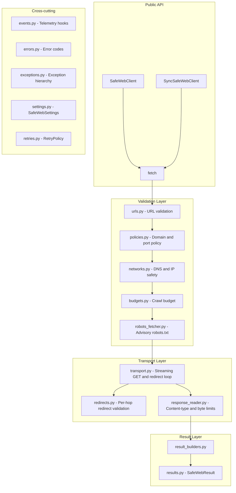

# Safe Web Access

[](https://pypi.org/project/safe-web-access/)
[](https://python.org)
[](https://github.com/mirza1272/safe-web-access/blob/main/LICENSE)
[](https://github.com/mirza1272/safe-web-access/blob/main/docs/README.md)

Safe Web Access is a secure Python package for validated, budget-aware web fetching. It provides safe HTTP access for crawlers, AI agents, backend services, and RAG and ingestion pipelines. 

By default, the package provides robust SSRF protection, safe redirects, strict domain policies, and response size limits to prevent abuse and memory exhaustion. It also features automatic retries for transient errors and offers both async and sync clients.

## Project Links

- [PyPI Package](https://pypi.org/project/safe-web-access/)
- [GitHub Repository](https://github.com/mirza1272/safe-web-access)
- [Documentation Home](https://github.com/mirza1272/safe-web-access/blob/main/docs/README.md)
- [Complete Usage Guide](https://github.com/mirza1272/safe-web-access/blob/main/docs/USAGE.md)
- [Security Guide](https://github.com/mirza1272/safe-web-access/blob/main/docs/SECURITY.md)
- [Maintainer Guide](https://github.com/mirza1272/safe-web-access/blob/main/docs/HANDOVER.md)
- [Changelog](https://github.com/mirza1272/safe-web-access/blob/main/CHANGELOG.md)
- [Issue Tracker](https://github.com/mirza1272/safe-web-access/issues)
- [Security Advisory](https://github.com/mirza1272/safe-web-access/security/advisories/new)
- [Releases](https://github.com/mirza1272/safe-web-access/releases)

---

### Who Is This Package For?

This package is designed for Python developers building secure crawlers, AI-agent systems, backend APIs, RAG pipelines, ingestion services, and any applications accepting user-supplied URLs.

### Search Keywords

If you are looking for secure Python web fetching, SSRF-safe HTTP access, safe crawler requests, validated redirects, and budget-aware response handling, this package provides a complete, tested solution.

---

## Why This Package Exists

Imagine you have a delivery person who will carry a package to any address you give them. That is fine when you trust every address. But if a user or an automated agent can choose the address, someone might send the delivery person to a private internal room — your own database server, your internal admin panel, or a machine that should never be reached from outside.

That attack is called **Server-Side Request Forgery (SSRF)**. It happens when a backend service fetches a URL chosen by untrusted input without checking where that URL actually leads. The result can be data theft, internal service exposure, or memory exhaustion from huge downloads.

Technically: when your code calls a URL without validation, an attacker can supply a URL like `http://169.254.169.254/latest/meta-data/` (a cloud metadata endpoint) or `http://127.0.0.1:6379/` (a local Redis server) and extract sensitive data from your own infrastructure.

`safe-web-access` was built to solve this problem for crawlers, AI agents, and data ingestion pipelines that must fetch URLs from external or user-supplied input.

---

## What Safe Web Access Does

Every feature listed below corresponds to real, tested production code.

### URL Validation and Normalization

Think of this as checking that the address on an envelope is written correctly before even looking up where it goes. The package rejects malformed URLs, unsupported schemes (only `http` and `https` are allowed), embedded credentials, and URL fragments.

Technically: `validate_and_normalize_url` strips default ports, lowercases hostnames, and returns a structured `ValidatedUrl` object before any network activity begins.

### Scheme Restrictions

Only `http://` and `https://` URLs are accepted. Anything else — `ftp://`, `file://`, `javascript:`, `data:` — is immediately rejected.

### Domain Policy

Think of this as a guestlist. You decide in advance which websites are allowed in. If a URL's domain is not on the list, it is turned away at the door. You can also add a blocklist for domains you specifically want to ban, even if the rest of the list is open.

Technically: `DomainPolicy` supports exact domain matching, wildcard subdomain patterns (`*.example.com`), a blocklist that takes priority over the allowlist, and per-policy port restrictions. When `allowed_domains=None` (the default), any public domain is allowed — only the blocklist and port rules apply.

### Port Policy

By default, only ports 80 (HTTP) and 443 (HTTPS) are allowed. You can expand this with `allowed_ports` in `DomainPolicy`. Any port not in the list is rejected before a connection is made.

### Hostname Resolution and Public-IP Checks

Before connecting, the package looks up the IP address for every hostname. Think of it as checking that a postal address is not actually a secret internal room. If the IP address belongs to a private network, loopback address, link-local range, multicast range, or any reserved range — the request is blocked immediately.

Technically: `resolve_public_addresses` calls `socket.getaddrinfo` and checks every resolved IP using Python's `ipaddress` module. An address passes only when `ipaddress.is_global` returns `True` and none of the private/loopback/reserved flags are set.

### Redirect Inspection

Websites often send "redirects" — they say "the page you want is over here now." This package follows those redirects, but it checks each new destination before following it. Every redirect target is validated for scheme, domain policy, network safety, and loop detection.

Technically: HTTP `follow_redirects=False` is set on the underlying `httpx` client. The package manually validates each `3xx Location` header using `validate_redirect_target`, enforces the `max_redirects` limit, and checks for redirect loops before making the next connection.

### Robots.txt Advisory Checking

Every well-behaved web crawler checks a file called `robots.txt` that websites publish to say which pages crawlers are allowed to visit. This package fetches and reads that file and reports the advisory result in every response. The word "advisory" is important: the package reports the result but does not automatically block the fetch. Your code decides what to do with the information.

Technically: `fetch_robots_advisory` returns a `RobotsCheckResult` with a `RobotsStatus` of `allowed`, `disallowed`, `missing`, `unreachable`, or `invalid`. This status is surfaced in `SafeWebResult.robots_status`.

### Content-Type Checking

The package checks what type of content the server says it is sending before downloading the full response. If the server claims to send an executable file, a video, or a ZIP archive, the request is rejected. Only declared content types are downloaded.

By default the allowed types are: `text/html`, `text/plain`, `application/xhtml+xml`.

Technically: `validate_content_type` parses the `Content-Type` header, normalizes it, and checks it against `SafeWebSettings.allowed_content_types`. The check happens before the response body is streamed.

### Streamed Byte Limits

Rather than downloading the entire response into memory at once, the package streams the response in chunks and counts bytes as they arrive. If the response body grows beyond the configured limit, the download is cancelled immediately. This prevents memory exhaustion from very large files or decompression bombs.

Technically: The `max_response_bytes` setting caps a single response. The `Content-Length` header is checked before streaming begins. Each chunk is measured during `aiter_bytes()`.

### Cumulative Crawl Budgets

A crawl budget is like a spending limit for a shopping trip. You set a maximum number of pages and a maximum total number of bytes before you start. Each successful fetch consumes from that budget. When the budget runs out, no more requests are allowed.

Technically: `CrawlBudget` is an immutable frozen dataclass. Every successful fetch returns a new `CrawlBudget` object with updated counters. You pass the returned budget into the next request to chain them correctly.

### Bounded Retries with Backoff

When a server is temporarily unavailable, the package can automatically try again after a short wait. You control how many times it retries, how long it waits between attempts, and which HTTP status codes trigger a retry.

The retry logic respects the server's own `Retry-After` response header when `respect_retry_after=True`.

Importantly: **security failures are never retried**. An SSRF block, a domain policy violation, or a bad URL will never be retried regardless of retry configuration.

Technically: `RetryPolicy.max_attempts` sets the total number of attempts (not extra attempts — 1 means no retry). Retryable status codes default to `(408, 429, 502, 503, 504)`. Backoff uses `base * multiplier^(attempt-1)` capped at `backoff_max_seconds`.

### Synchronous Client

`SyncSafeWebClient` provides a plain synchronous Python interface. It runs a dedicated background event loop on a private thread so you can call `.fetch()` like any normal function — no `async` or `await` required.

### Asynchronous Client

`SafeWebClient` is the primary async client. It uses `httpx.AsyncClient` internally and exposes `await client.fetch(url)`. It is the right choice for async web frameworks, asyncio services, and high-concurrency crawlers.

### Event Hooks

The package emits structured telemetry events at each stage of a request — URL validation, policy check, network check, robots check, retry scheduling, redirect following, response reading, and completion. You can attach your own functions to receive these events for logging, metrics, or debugging.

Event payloads never contain response body bytes, request headers, cookies, or authorization tokens.

### Structured Results

Every `fetch()` call returns a `SafeWebResult` object — never raises an exception into your code. Successes and failures use the same structure, making it simple to handle both cases without try/except blocks.

---

## What It Does Not Do

These are deliberate non-features. They keep the security model focused:

- **Does not parse HTML** or extract structured data from page content.
- **Does not extract emails, phone numbers, or any other entities** from responses.
- **Does not execute JavaScript.** Use a headless browser (Playwright, Puppeteer) for that.
- **Does not automate browsers** or interact with page UI elements.
- **Does not solve CAPTCHAs** or bypass any anti-bot mechanisms.
- **Does not provide full protection against DNS rebinding.** IP validation happens before the connection is opened. A malicious DNS server that changes its answer between resolution and connection can still bypass this check. See [docs/SECURITY.md](https://github.com/mirza1272/safe-web-access/blob/main/docs/SECURITY.md) for details.
- **Does not provide a complete production crawler.** It fetches one page at a time, safely. Scheduling, link extraction, deduplication, and storage are your responsibility.

---

## How the Package Thinks About a Request

Here is the exact sequence of steps for every `fetch()` call:

1. **Receive the URL string.** The raw string you pass in.
2. **Validate and normalize the URL.** Check scheme, strip fragments and credentials, normalize hostname case, remove default ports.
3. **Check domain and port policy.** Compare the normalized hostname and port against your `DomainPolicy` blocklist and allowlist.
4. **Resolve DNS and check IP safety.** Call the system DNS resolver, parse every returned IP address, and reject any address that is private, loopback, link-local, multicast, or reserved.
5. **Check crawl budget.** Verify that the `CrawlBudget` still has remaining pages and bytes before spending a request.
6. **Fetch robots.txt (advisory).** Retrieve and parse the target site's `robots.txt` file and record the advisory result. This check is skipped on retries because the result is cached from the first attempt.
7. **Open a streaming HTTP connection.** Send the `GET` request with `follow_redirects=False`.
8. **Validate each redirect manually.** For every `3xx` response, validate the `Location` header against scheme, domain policy, network safety, loop detection, and redirect count before following.
9. **Validate the response content type.** Read the `Content-Type` header and reject anything not in the allowed list.
10. **Validate declared content length.** If the server declared a `Content-Length`, check it is not negative, does not exceed `max_response_bytes`, and does not exceed the remaining crawl budget bytes.
11. **Stream the response body.** Read chunks, measuring cumulative bytes. Cancel if limits are exceeded.
12. **Update the crawl budget.** Record the consumed page and bytes in the returned `CrawlBudget`.
13. **Return a structured result.** Assemble `SafeWebResult` with all metadata.

---

## Installation

Install the latest release:

```bash
pip install safe-web-access
```

Install this exact version:

```bash
pip install safe-web-access==0.1.2
```

Install in editable mode for development (includes test, lint, and build tools):

```bash
pip install -e ".[dev]"
```

Verify the installation:

```bash
python -c "import safe_web_access; print(safe_web_access.__version__)"
```

---

## Five-Minute Quick Start

### Async Client

```python
"""Minimal async fetch example using SafeWebClient."""

import asyncio
from safe_web_access import SafeWebClient


async def main() -> None:
    # Use the client as an async context manager so it closes automatically.
    async with SafeWebClient() as client:
        # fetch() always returns a SafeWebResult — it never raises.
        result = await client.fetch("https://example.com")

        if result.success:
            # result.body is always raw bytes on success.
            # Decode only when you know the charset.
            text = result.body.decode("utf-8", errors="replace")
            print(f"Status:        {result.status_code}")
            print(f"Content-Type:  {result.content_type}")
            print(f"Body size:     {result.size_bytes} bytes")
            print(f"Redirects:     {result.redirect_count}")
            print(f"Robots status: {result.robots_status}")
            print(f"First 100 chars: {text[:100]}")
        else:
            # result.error_code and result.error_message are always set on failure.
            print(f"Fetch failed [{result.error_code}]: {result.error_message}")


asyncio.run(main())
```

### Sync Client

```python
"""Minimal synchronous fetch example using SyncSafeWebClient."""

from safe_web_access import SyncSafeWebClient


def main() -> None:
    # Use the client as a context manager so it closes automatically.
    with SyncSafeWebClient() as client:
        # fetch() blocks until the result is ready.
        result = client.fetch("https://example.com")

        if result.success:
            print(f"Status:       {result.status_code}")
            print(f"Body size:    {result.size_bytes} bytes")
        else:
            print(f"Failed [{result.error_code}]: {result.error_message}")


if __name__ == "__main__":
    main()
```

---

## Client Lifecycle

Both clients support two lifecycle styles. Pick whichever fits how long the client lives.

### Context manager — preferred for a bounded piece of work

The client closes itself when the block exits, even if an exception is raised.

```python
async with SafeWebClient() as client:
    result = await client.fetch("https://example.com")
```

```python
with SyncSafeWebClient() as client:
    result = client.fetch("https://example.com")
```

### Manual `start()` / `close()` — for a long-lived client

Use this when the client outlives any single block: a service object built once at
application startup and closed on shutdown, a FastAPI dependency, or a background worker.

```python
class WebAccessService:
    """Keeps one client for the process lifetime instead of rebuilding it per request."""

    def __init__(self) -> None:
        self._client: SafeWebClient | None = None

    async def start(self) -> None:
        if self._client is None:
            self._client = await SafeWebClient().start()

    async def close(self) -> None:
        if self._client is not None:
            await self._client.close()
            self._client = None

    async def fetch(self, url: str) -> SafeWebResult:
        if self._client is None:
            await self.start()
        return await self._client.fetch(url)
```

The synchronous client works the same way without `await`:

```python
client = SyncSafeWebClient().start()
try:
    result = client.fetch("https://example.com")
finally:
    client.close()
```

### What the lifecycle methods guarantee

| Method | Behaviour |
|---|---|
| `start()` | Returns the client itself, so `await SafeWebClient().start()` reads naturally. Safe to call more than once. Raises `RuntimeError` if the client is already closed. Performs no setup work — the constructor already builds everything, so `start()` is purely a symmetry and readability aid. |
| `close()` | Closes the client. Idempotent. On the async client this is an awaitable alias of `aclose()`. |
| `aclose()` | The async-convention name. Identical to `close()`; neither is deprecated, use whichever reads better. |

**Calling `start()` is optional.** A freshly constructed client is already usable —
`SafeWebClient().fetch(url)` works. `start()` exists so that code managing the lifecycle by
hand has a matching pair of calls rather than an asymmetric "construct, then close".

**Closing is not optional when the client owns its transport.** If you did not pass your own
`httpx.AsyncClient`, the client created one and must close it to release the connection pool.
If you *did* pass one, closing the `SafeWebClient` deliberately leaves your client open —
you own it, so you close it.

**After closing, `fetch()` does not raise.** It returns a normal failure `SafeWebResult` with
`error_code="request_failed"` and `error_message="Client is closed."`, keeping the promise that
`fetch()` never raises.

---

## Understanding SafeWebResult

Every call to `fetch()` returns exactly one `SafeWebResult`. It is a frozen (immutable) dataclass. You cannot change its fields after it is created.

### Field Reference

| Field | Type | Present When | Simple Meaning | Technical Meaning |
|---|---|---|---|---|
| `success` | `bool` | Always | Did it work? | `True` when HTTP status is 2xx and body was fully read within limits. |
| `requested_url` | `str` | Always | The URL you asked for. | The raw string you passed to `fetch()`. |
| `final_url` | `str \| None` | Success | The URL where the content was actually found. | Normalized URL after following all redirects. `None` on failure before first connection. |
| `status_code` | `int \| None` | When a response arrived | The server's response code. | HTTP status code (100–599). `None` when the request never reached the server. |
| `content_type` | `str \| None` | Success | What kind of content the server sent. | Normalized media type string (e.g. `text/html`). `None` on failure. |
| `method` | `str` | Always | The HTTP verb used. | Always `"GET"` in the current version. |
| `elapsed_ms` | `int \| None` | Always | How long the request took, in milliseconds. | Wall-clock time from `fetch()` entry to result construction. |
| `size_bytes` | `int` | Always | How many bytes were downloaded. | `0` on failure before body was read. Equals `len(body)` on success. |
| `body` | `bytes \| None` | Success | The raw response content. | `None` on failure. Always `bytes` on success — decode yourself. |
| `cleaned_text` | `str \| None` | Never (reserved) | Reserved field, always `None`. | Not populated in the current version. |
| `robots_status` | `str \| None` | When robots check ran | What robots.txt said. | One of: `"allowed"`, `"disallowed"`, `"missing"`, `"unreachable"`, `"invalid"`, or `None`. |
| `budget` | `CrawlBudget \| None` | When a budget is tracked | Remaining crawl allowance after this request. | Updated immutable `CrawlBudget`. Pass to next `fetch()` call. |
| `error_code` | `str \| None` | Failure | A short code describing what went wrong. | `None` on success. String error code on failure. |
| `error_message` | `str \| None` | Failure | A human-readable failure description. | `None` on success. Non-empty string on failure. |
| `redirect_count` | `int` | Always | How many redirects were followed. | `0` if the first URL responded without redirecting. |
| `attempt_count` | `int` | Always | How many total attempts were made. | At least `1`. Greater than `1` when retries happened. |

### Invariants

When `success=True`:
- `body` is `bytes` (never `None`)
- `size_bytes == len(body)`
- `status_code` is between 200 and 299
- `final_url` is a non-empty string
- `content_type` is a non-empty string
- `error_code` is `None`
- `error_message` is `None`

When `success=False`:
- `body` is `None`
- `error_code` is a non-empty string
- `error_message` is a non-empty string

### Result Examples

**Successful fetch:**
```python
SafeWebResult(
    success=True,
    requested_url="https://example.com",
    final_url="https://example.com/",
    status_code=200,
    content_type="text/html",
    method="GET",
    elapsed_ms=342,
    size_bytes=1256,
    body=b"<html>...</html>",
    robots_status="allowed",
    budget=CrawlBudget(max_pages=20, max_total_bytes=20000000, pages_used=1, bytes_used=1256),
    error_code=None,
    error_message=None,
    redirect_count=1,
    attempt_count=1,
)
```

**HTTP error (404):**
```python
SafeWebResult(
    success=False,
    requested_url="https://example.com/missing",
    final_url="https://example.com/missing",
    status_code=404,
    error_code="http_error",
    error_message="HTTP request failed with status code 404.",
    attempt_count=1,
    ...
)
```

**Blocked private network:**
```python
SafeWebResult(
    success=False,
    requested_url="http://192.168.1.1/admin",
    error_code="private_network",
    error_message="Hostname resolves to an unsafe network address.",
    ...
)
```

**After 3 retry attempts:**
```python
SafeWebResult(
    success=False,
    requested_url="https://example.com",
    status_code=503,
    error_code="http_error",
    error_message="HTTP request failed with status code 503.",
    attempt_count=3,
    ...
)
```

---

## SafeWebSettings

`SafeWebSettings` is a frozen dataclass that holds all configuration for one client instance. You create it once and pass it to the client. You cannot change it after creation.

```python
from safe_web_access import SafeWebSettings, DomainPolicy, RetryPolicy

settings = SafeWebSettings(
    connect_timeout_seconds=10.0,
    read_timeout_seconds=20.0,
    max_redirects=5,
    max_response_bytes=3_000_000,
    max_pages=20,
    max_total_bytes=20_000_000,
    user_agent="MyBot/1.0",
    allowed_content_types=("text/html", "text/plain", "application/xhtml+xml"),
    domain_policy=DomainPolicy(),
    retry_policy=RetryPolicy(),
    strict_event_hooks=False,
)
```

### Settings Field Reference

| Field | Default | Simple Meaning | Technical Behavior | When to Change |
|---|---|---|---|---|
| `connect_timeout_seconds` | `10.0` | How long to wait to open a connection. | Seconds before `ConnectTimeout` is raised. Must be > 0. | Lower for fast-fail; raise for slow networks. |
| `read_timeout_seconds` | `20.0` | How long to wait for data after connecting. | Seconds before `ReadTimeout` between chunks. Must be > 0. | Raise for large slow responses. |
| `max_redirects` | `5` | How many times a page can forward to another page. | Maximum redirect hops. `0` disables redirects. | Lower to reduce exposure; `0` for no-redirect APIs. |
| `max_response_bytes` | `3_000_000` | Maximum size of a single response (3 MB). | Hard cap on bytes per response. Checked on `Content-Length` and during streaming. | Raise for large documents; lower for text-only pipelines. |
| `max_pages` | `20` | Maximum pages per crawl budget. | Default budget page limit when no `CrawlBudget` is passed to `fetch()`. | Set to `1` for single-page fetches. |
| `max_total_bytes` | `20_000_000` | Maximum total bytes across all pages (20 MB). | Default budget byte cap. Must be >= `max_response_bytes`. | Lower for tight memory environments. |
| `user_agent` | `"SafeWebAccess/1.0"` | The name your bot sends to servers. | `User-Agent` HTTP header value. Must be a non-empty string. | Set your own bot name. |
| `allowed_content_types` | `("text/html", "text/plain", "application/xhtml+xml")` | What kinds of content are allowed. | Checked against normalized `Content-Type` header. Must be a non-empty tuple. | Add `"application/pdf"` for PDF ingestion. |
| `domain_policy` | `DomainPolicy()` | Which domains and ports are allowed. | Instance of `DomainPolicy`. Evaluated before DNS resolution. | Always configure for production. |
| `retry_policy` | `RetryPolicy()` | How to retry failed requests. | Instance of `RetryPolicy`. Default is `max_attempts=1` (no retry). | Increase `max_attempts` for unreliable servers. |
| `strict_event_hooks` | `False` | Whether a hook error should stop the request. | When `True`, any exception in an event hook is re-raised. When `False`, hook errors are silently ignored. | Set `True` in tests; leave `False` in production. |

---

## DomainPolicy

`DomainPolicy` is a frozen dataclass that controls which domains and ports are reachable.

```python
from safe_web_access import DomainPolicy

# Allow only example.com and all its subdomains
policy = DomainPolicy(
    allowed_domains=("example.com",),
    blocked_domains=("internal.example.com",),
    allowed_ports=(80, 443, 8443),
    allow_subdomains=True,
)
```

### Fields

| Field | Default | Meaning |
|---|---|---|
| `allowed_domains` | `None` | Tuple of allowed domain patterns, or `None` to allow all public domains. |
| `blocked_domains` | `()` | Tuple of explicitly blocked domain patterns. Blocklist always wins. |
| `allowed_ports` | `(80, 443)` | Tuple of allowed destination port numbers. |
| `allow_subdomains` | `True` | When `True`, subdomains of an allowed domain are also allowed (without needing `*` prefix). |

### Domain Matching

A pattern can be:
- **Exact domain:** `"example.com"` — matches only `example.com`.
- **Wildcard subdomain:** `"*.example.com"` — matches `api.example.com`, `blog.example.com`, but NOT `example.com` itself.

When `allow_subdomains=True` (the default), an exact pattern like `"example.com"` also matches `api.example.com`, `blog.example.com`, etc. — no wildcard prefix needed.

Blocklist patterns use the same matching rules and are checked before the allowlist. If a domain matches a blocklist pattern, it is rejected even if it also matches an allowlist pattern.

### Matching Examples

| URL | allowed_domains | blocked_domains | allow_subdomains | Result |
|---|---|---|---|---|
| `https://example.com` | `("example.com",)` | `()` | `True` | ✅ Allowed |
| `https://api.example.com` | `("example.com",)` | `()` | `True` | ✅ Allowed (subdomain) |
| `https://api.example.com` | `("example.com",)` | `()` | `False` | ❌ Blocked (not exact) |
| `https://api.example.com` | `("*.example.com",)` | `()` | `False` | ✅ Allowed (wildcard) |
| `https://evil.example.com` | `("example.com",)` | `("evil.example.com",)` | `True` | ❌ Blocked (blocklist) |
| `https://example.com` | `None` | `()` | `True` | ✅ Allowed (no allowlist) |

### Port Matching

The effective port is the port in the URL, or 80 for `http://` and 443 for `https://` when no port is stated. If this effective port is not in `allowed_ports`, the request is rejected.

```python
# Custom port example
policy = DomainPolicy(allowed_ports=(80, 443, 8080, 8443))
```

### Suffix Attack Prevention

Domain entries that contain URL-structural characters (`://`, `@`, `/`, `?`, `#`) are rejected at construction time. Wildcard entries must start with `*.` and have a valid base domain containing at least one dot. This prevents patterns like `"*.com"` from accidentally matching everything.

---

## RetryPolicy

`RetryPolicy` is a frozen dataclass that controls automatic retry behavior.

```python
from safe_web_access import RetryPolicy

# Retry up to 3 times total, with exponential backoff
retry = RetryPolicy(
    max_attempts=3,
    backoff_base_seconds=0.5,
    backoff_max_seconds=10.0,
    backoff_multiplier=2.0,
    retry_status_codes=(408, 429, 502, 503, 504),
    respect_retry_after=True,
    jitter_seconds=0.0,
)
```

### Fields

| Field | Default | Meaning |
|---|---|---|
| `max_attempts` | `1` | Total number of attempts including the first one. `1` means no retry. Must be >= 1. |
| `backoff_base_seconds` | `0.5` | Base wait time in seconds before the first retry. |
| `backoff_max_seconds` | `10.0` | Maximum wait time in seconds, regardless of how backoff grows. |
| `backoff_multiplier` | `2.0` | Factor by which wait time grows on each retry. Must be >= 1.0. |
| `retry_status_codes` | `(408, 429, 502, 503, 504)` | HTTP status codes that trigger a retry. |
| `respect_retry_after` | `True` | When `True`, uses the server's `Retry-After` header value as the wait time. |
| `jitter_seconds` | `0.0` | Fixed extra seconds added to every calculated delay. Helps prevent retry storms. |

### Attempts vs. Retries

`max_attempts=1` means one try, no retry.
`max_attempts=3` means try up to three times — if the first attempt fails with a retryable error, try again, and if that fails, try one more time.

### Retry Timeline Example (max_attempts=3, base=0.5s, multiplier=2.0)

```
Attempt 1 → HTTP 503 → wait 0.5s → Attempt 2 → HTTP 503 → wait 1.0s → Attempt 3 → HTTP 200 ✅
```

If `Retry-After: 30` is in the response header and `respect_retry_after=True`, the delay is 30 seconds (capped at `backoff_max_seconds`).

### What Is Never Retried

Security failures are never retried, regardless of retry configuration:
- SSRF / private network blocks
- Domain or port policy violations
- Invalid or unsupported URLs
- Crawl budget exhaustion
- Unsupported content types
- Response size limit exceeded

Only `SafeWebConnectTimeout`, `SafeWebReadTimeout`, `SafeWebRequestTimeout`, `SafeWebConnectionError`, and the configured `retry_status_codes` trigger retries.

---

## CrawlBudget

A crawl budget is a spending limit for a series of web requests. It tracks how many pages you have fetched and how many total bytes you have downloaded.

`CrawlBudget` is a frozen dataclass. This means it is immutable — no budget object is ever changed. Instead, each successful fetch returns a **new** budget object with updated counters.

Think of it like a scorecard that you hand to each player in turn. After each turn, you get a new card showing the updated score. You never erase the old card.

### Creating a Budget

```python
from safe_web_access import CrawlBudget

# Allow up to 10 pages and 5 MB total
budget = CrawlBudget(max_pages=10, max_total_bytes=5_000_000)
```

### Fields and Properties

| Name | Kind | Meaning |
|---|---|---|
| `max_pages` | Field | Maximum pages this budget allows. |
| `max_total_bytes` | Field | Maximum total bytes this budget allows. |
| `pages_used` | Field | Pages consumed so far. |
| `bytes_used` | Field | Bytes consumed so far. |
| `remaining_pages` | Property | `max_pages - pages_used` |
| `remaining_bytes` | Property | `max_total_bytes - bytes_used` |
| `is_exhausted` | Property | `True` when either remaining counter is <= 0. |

### Correct Multi-Page Usage

```python
import asyncio
from safe_web_access import CrawlBudget, SafeWebClient

async def crawl_two_pages() -> None:
    budget = CrawlBudget(max_pages=5, max_total_bytes=2_000_000)

    async with SafeWebClient() as client:
        # Fetch first page — pass the starting budget
        result1 = await client.fetch("https://example.com/page1", budget=budget)

        if result1.success:
            # result1.budget is a NEW object with updated counters
            # Pass it to the next request
            result2 = await client.fetch(
                "https://example.com/page2",
                budget=result1.budget,
            )
            print(f"Pages used: {result2.budget.pages_used if result2.budget else '?'}")

asyncio.run(crawl_two_pages())
```

**Common mistake:** reusing the original `budget` object for every request. Because `CrawlBudget` is immutable, the original object never changes. Every request would see `pages_used=0` and never detect budget exhaustion. Always chain through `result.budget`.

---

## Robots.txt Advisory Behavior

`robots.txt` is a plain-text file that websites publish at `https://example.com/robots.txt`. It contains instructions for web crawlers — listing which paths they are allowed or not allowed to visit.

This package **always** fetches and reads `robots.txt` (unless you pass `check_robots=False` to `fetch()`). It reports the result in `SafeWebResult.robots_status`. It does **not** automatically block the request when status is `disallowed`. That decision is left to your code.

### Possible Statuses

| `robots_status` | Meaning |
|---|---|
| `"allowed"` | `robots.txt` was found and explicitly allows this page. |
| `"disallowed"` | `robots.txt` was found and explicitly disallows this page. |
| `"missing"` | `robots.txt` returned 404 or 410 — the site has no robots file. |
| `"unreachable"` | `robots.txt` could not be fetched due to a network error, timeout, or redirect issue. |
| `"invalid"` | `robots.txt` was fetched but could not be parsed. |

### Caller-Enforced Block Example

```python
result = await client.fetch("https://example.com/private")

if result.robots_status == "disallowed":
    # Your policy: treat disallowed as a hard block.
    print("Skipping page — robots.txt does not allow it.")
elif result.success:
    process(result.body)
```

This design gives you full control. Your application decides the policy. The package only provides the information.

---

## Event Hooks

Event hooks let you observe what the package is doing — logging, metrics, or debugging — without changing its behavior.

### Event Types (in order of occurrence)

| Event Type | When It Fires |
|---|---|
| `REQUEST_STARTED` | At the start of every `fetch()` call. |
| `ATTEMPT_STARTED` | At the start of each attempt (including retries). |
| `URL_VALIDATED` | After the URL is parsed and normalized. |
| `POLICY_VALIDATED` | After domain and port policy checks pass. |
| `NETWORK_VALIDATED` | After DNS resolution and public-IP verification pass. |
| `BUDGET_VALIDATED` | After crawl budget check passes. |
| `ROBOTS_CHECKED` | After the robots.txt advisory result is known. |
| `REDIRECT_FOLLOWED` | After a redirect is validated and followed. |
| `RESPONSE_HEADERS_VALIDATED` | After content type and length checks pass. |
| `RESPONSE_BODY_READ` | After the full body is streamed. |
| `RETRY_SCHEDULED` | When a retry is being scheduled. |
| `REQUEST_SUCCEEDED` | When the full request completes successfully. |
| `REQUEST_FAILED` | When the request fails for any reason. |
| `CLIENT_CLOSED` | When the client is closed. |

### SafeWebEvent Fields

| Field | Meaning |
|---|---|
| `event_type` | The `SafeWebEventType` enum value. |
| `requested_url` | The original URL passed to `fetch()`. |
| `current_url` | The URL being processed at this stage. |
| `final_url` | The URL after all redirects (on completion events). |
| `attempt_number` | Which attempt number this event belongs to. |
| `status_code` | HTTP status code, when available. |
| `redirect_count` | Redirect hops so far. |
| `elapsed_ms` | Milliseconds elapsed from request start. |
| `size_bytes` | Bytes read so far. |
| `error_code` | Error code string on failure events. |
| `message` | Human-readable description. |

**Never included in events:** request headers, cookies, authorization tokens, response body bytes, passwords.

### Hook Examples

```python
import logging
from safe_web_access import SafeWebClient, SafeWebEvent, SafeWebEventType

logger = logging.getLogger("safe_web_access")

# Synchronous hook
def log_event(event: SafeWebEvent) -> None:
    # Safe: logs only URL and event type — never body content
    logger.info("[%s] %s (attempt %d)", event.event_type, event.requested_url, event.attempt_number)

# Async hook — both sync and async hooks work
async def log_retry(event: SafeWebEvent) -> None:
    if event.event_type == SafeWebEventType.RETRY_SCHEDULED:
        logger.warning("Retry scheduled for %s: %s", event.requested_url, event.message)

async with SafeWebClient(event_hooks=(log_event, log_retry)) as client:
    result = await client.fetch("https://example.com")
```

Hook errors are silently ignored by default. Set `strict_event_hooks=True` in `SafeWebSettings` to make them fatal (useful in tests).

---

## Async Versus Sync Client

| | `SafeWebClient` | `SyncSafeWebClient` |
|---|---|---|
| **Usage style** | `await client.fetch(url)` | `client.fetch(url)` |
| **Requires async context** | Yes | No |
| **Context manager** | `async with` | `with` |
| **Manual start** | `await client.start()` | `client.start()` |
| **Close method** | `await client.close()` or `await client.aclose()` | `client.close()` |
| **Best for** | asyncio applications, FastAPI, async pipelines | Scripts, Django, Flask, CLI tools |
| **Thread safety** | Not documented | Runs on a dedicated background thread |
| **Background thread** | No | Yes — one thread per client instance |
| **Background loop** | No (uses caller's loop) | Yes — one event loop per client instance |

Both clients use the same underlying safety logic. `SyncSafeWebClient` is a thin wrapper that runs `SafeWebClient` on a private background event loop and thread, blocking the calling thread until the result is ready.

---

## Error Handling

`fetch()` never raises. All failures are reported through `SafeWebResult`. The `error_code` field tells you the category of failure.

### Error Codes by Category

**URL errors:**
| Code | Meaning |
|---|---|
| `invalid_url` | URL is malformed, empty, or contains forbidden components (credentials, fragments). |
| `unsupported_scheme` | URL scheme is not `http` or `https`. |

**Policy errors:**
| Code | Meaning |
|---|---|
| `domain_not_allowed` | Domain is not in the allowlist. |
| `blocked_domain` | Domain is in the blocklist. |
| `port_not_allowed` | Port is not in the allowed ports list. |
| `invalid_policy` | Domain policy configuration is malformed. |

**Network errors:**
| Code | Meaning |
|---|---|
| `private_network` | Hostname resolves to a private, loopback, or reserved IP address. |
| `dns_resolution_failed` | Hostname could not be resolved at all. |

**Redirect errors:**
| Code | Meaning |
|---|---|
| `too_many_redirects` | Redirect chain exceeds `max_redirects`, or a redirect loop was detected. |
| `unsafe_redirect` | Redirect target URL is invalid or unsafe. |

**Budget errors:**
| Code | Meaning |
|---|---|
| `page_budget_exceeded` | Crawl page budget is exhausted. |
| `byte_budget_exceeded` | Crawl byte budget is exhausted. |

**Response errors:**
| Code | Meaning |
|---|---|
| `unsupported_content_type` | Response `Content-Type` is not in the allowed list. |
| `response_too_large` | Response body exceeds `max_response_bytes`. |

**Timeout and transport errors:**
| Code | Meaning |
|---|---|
| `connection_timeout` | Could not open a connection within `connect_timeout_seconds`. |
| `read_timeout` | Did not receive data within `read_timeout_seconds`. |
| `request_failed` | General transport or network failure. |

**HTTP status errors:**
| Code | Meaning |
|---|---|
| `http_error` | Server responded with a non-2xx status code that was not retried. |

**Lifecycle errors:**
| Code | Meaning |
|---|---|
| `request_failed` | Client is already closed, or other lifecycle violation. |

---

## Security Model

`safe-web-access` is designed with SSRF prevention and download safety as its primary goals. See [docs/SECURITY.md](https://github.com/mirza1272/safe-web-access/blob/main/docs/SECURITY.md) for the complete threat model, attack scenarios, DNS rebinding limitations, and deployment recommendations.

---

## Package Architecture



---

## Project Structure

```
safe-web-access/
├── src/
│   └── safe_web_access/       # All production Python modules
│       ├── __init__.py        # Public API exports
│       ├── budgets.py         # CrawlBudget — immutable page/byte tracking
│       ├── client.py          # SafeWebClient — async orchestrator
│       ├── content_types.py   # Content-Type header validation
│       ├── errors.py          # SafeWebErrorCode enum
│       ├── events.py          # SafeWebEvent, SafeWebEventType, EventHook
│       ├── exceptions.py      # Typed exception hierarchy
│       ├── networks.py        # DNS resolution and IP safety
│       ├── policies.py        # DomainPolicy — domain/port filtering
│       ├── py.typed           # PEP 561 marker — package ships type stubs
│       ├── redirects.py       # Per-hop redirect validation
│       ├── response_reader.py # Header + body streaming with byte limits
│       ├── result_builders.py # SafeWebResult factory helpers
│       ├── results.py         # SafeWebResult frozen dataclass
│       ├── retries.py         # RetryPolicy — backoff and Retry-After
│       ├── robots.py          # robots.txt parsing and evaluation
│       ├── robots_fetcher.py  # robots.txt fetching with redirect support
│       ├── settings.py        # SafeWebSettings frozen dataclass
│       ├── sync_client.py     # SyncSafeWebClient — sync wrapper
│       ├── transport.py       # Streaming GET with manual redirect loop
│       └── urls.py            # URL parsing and normalization
├── tests/                     # Complete test suite (228 tests)
├── examples/                  # Runnable usage examples
├── docs/                      # Extended documentation
│   ├── README.md              # Documentation home and learning map
│   ├── USAGE.md               # Full user manual with recipes
│   ├── SECURITY.md            # Threat model and security guide
│   └── HANDOVER.md            # Maintainer manual
├── .github/
│   └── workflows/ci.yml       # GitHub Actions CI
├── pyproject.toml             # Build configuration (hatchling)
├── README.md                  # This file
├── LICENSE                    # MIT License
├── SECURITY.md                # Vulnerability reporting policy
├── CHANGELOG.md               # Version history
└── CONTRIBUTING.md            # Contributor guide
```

---

## Development Commands

```bash
# Install in editable mode with all development dependencies
python -m pip install -e ".[dev]"

# Byte-compile all source and test files to catch syntax errors
python -m compileall src tests examples

# Run focused tests for one module
python -m pytest tests/test_client.py -v

# Run the complete test suite
python -m pytest tests -q

# Run tests with branch coverage report
python -m pytest tests \
    --cov=safe_web_access \
    --cov-branch \
    --cov-report=term-missing

# Lint with Ruff (fast)
python -m ruff check src tests examples

# Format check with Black
python -m black --check src tests examples

# Type check with mypy (strict mode)
python -m mypy src/safe_web_access

# Build wheel and source distribution
python -m build

# Verify distribution metadata and contents
python -m twine check dist/*
```

---

## Release Artifacts

When you run `python -m build`, two files are created in the `dist/` folder:

- **Wheel (`.whl`):** Think of this as a pre-packed box. When someone installs it, Python just opens the box and places the files in the right locations. Fast to install.
- **Source distribution (`.tar.gz`):** Think of this as raw ingredients with assembly instructions. The installer has to compile/prepare anything needed. Slower to install, but transparent and complete.

Both artifacts are checked with `python -m twine check dist/*` to verify that package metadata is complete before publishing.

Wheel contents (verifiable with `unzip -l dist/*.whl`):
- `safe_web_access/` source modules
- `safe_web_access-X.Y.Z.dist-info/` metadata
- No test files, no cache directories, no local paths

---

## Compatibility

- **Python:** 3.11, 3.12, 3.13
- **Runtime dependency:** `httpx>=0.24.0,<1.0.0`
- **No other runtime dependencies**

---

## Known Limitations

1. **DNS rebinding (TOCTOU):** IP safety is checked before the connection is opened. A DNS server that returns a public IP during resolution but switches to a private IP during the actual TCP connection can bypass SSRF protection. This is a known limitation of pre-connection DNS validation without IP pinning at the socket layer.

2. **GET only:** Only `GET` requests are supported. `POST`, `PUT`, `PATCH`, `DELETE`, and `HEAD` are not implemented.

3. **No decompression control:** Decompression behavior for `Content-Encoding: gzip` is controlled by `httpx`. The byte limit applies to decompressed bytes as they arrive.

4. **No HTML parsing:** Response bodies are returned as raw bytes. Parsing is your responsibility.

5. **No link extraction:** The package fetches one URL at a time. Building a crawler queue is your responsibility.

6. **No JavaScript execution:** Dynamic content rendered by JavaScript is not accessible.

7. **No concurrency control:** The package does not limit how many concurrent `fetch()` calls you make. Rate limiting is your responsibility.

---

## License

Safe Web Access is released under the [MIT License](https://github.com/mirza1272/safe-web-access/blob/main/LICENSE).

---

## Security Reporting

To report a security vulnerability, please open a **private security advisory** on the GitHub repository:

`https://github.com/mirza1272/safe-web-access/security/advisories/new`

Do not open a public issue for security vulnerabilities. See [SECURITY.md](https://github.com/mirza1272/safe-web-access/blob/main/SECURITY.md) for the full reporting policy and what information to include.
