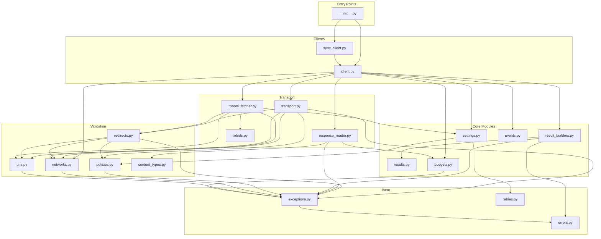
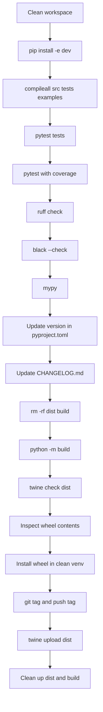

# Safe Web Access — Maintainer Manual

This document is written for developers who maintain, extend, or release `safe-web-access`. It covers the internal architecture, invariants, how to change things safely, the test suite, and the release process.

---

## Package Purpose

`safe-web-access` is an independent Python library that fetches web pages safely. It blocks SSRF attacks, enforces domain and port policies, validates every redirect hop, limits download sizes, tracks crawl budgets, and returns structured results instead of raising exceptions.

It is designed to be used in crawlers, AI agents, data ingestion pipelines, and backend services that need to fetch URLs supplied by external sources or automated systems.

---

## Current Version and Stability

- **Version:** `0.1.2` (see `pyproject.toml`)
- **Stability:** Beta — public API is established but may receive breaking changes before `1.0.0`.
- **Python compatibility:** 3.11, 3.12, 3.13
- **Runtime dependency:** `httpx>=0.24.0,<1.0.0`

---

## Repository Layout

```
safe-web-access/
├── src/
│   └── safe_web_access/       # All production modules
├── tests/                     # Test suite (228 tests, 96% branch coverage)
├── examples/                  # Runnable demonstration scripts
├── docs/                      # Extended documentation
├── .github/
│   └── workflows/ci.yml       # GitHub Actions CI
├── pyproject.toml             # Build config (hatchling)
├── README.md                  # Public landing page
├── SECURITY.md                # Vulnerability reporting policy
├── LICENSE                    # MIT
├── CHANGELOG.md               # Version history
└── CONTRIBUTING.md            # Contributor guide
```

---

## Module Ownership Table

| Module | Responsibility | Important Public Items | Called By | Must NOT Do |
|---|---|---|---|---|
| `__init__.py` | Public API surface | All exported names | User code | Contain logic or implementation |
| `settings.py` | All configurable limits | `SafeWebSettings` | `client.py`, `sync_client.py`, most modules | Network calls, mutable state |
| `results.py` | Result structure | `SafeWebResult` | `result_builders.py` | HTTP logic, mutation |
| `client.py` | Async orchestrator | `SafeWebClient`, `fetch()`, `start()`, `close()`, `aclose()` | `sync_client.py` | HTML parsing, business data extraction |
| `sync_client.py` | Sync wrapper | `SyncSafeWebClient`, `fetch()`, `start()`, `close()` | User code | Safety logic (all safety is in `client.py`) |
| `policies.py` | Domain/port filtering | `DomainPolicy`, `evaluate_url()` | `client.py`, `transport.py`, `robots_fetcher.py` | DNS resolution, IP checks |
| `networks.py` | DNS + IP safety | `resolve_public_addresses()`, `NetworkCheckResult` | `client.py`, `transport.py`, `redirects.py`, `robots_fetcher.py` | HTTP requests, domain policy |
| `urls.py` | URL parsing | `validate_and_normalize_url()`, `ValidatedUrl` | Most modules | DNS resolution, domain policy |
| `redirects.py` | Per-hop redirect validation | `validate_redirect_target()`, `RedirectResult` | `transport.py`, `robots_fetcher.py` | HTTP requests, body reading |
| `transport.py` | Streaming GET + redirect loop | `stream_safe_page()`, `TransportStream` | `client.py` | Body reading, budget tracking |
| `response_reader.py` | Header + body streaming | `read_response_body()`, `ReadResponseResult` | `client.py` | Domain policy, DNS, redirect logic |
| `content_types.py` | Content-Type validation | `validate_content_type()`, `ContentTypeResult` | `response_reader.py` | Body reading, budget tracking |
| `budgets.py` | Crawl budget tracking | `CrawlBudget`, `record_response()`, `ensure_request_allowed()` | `client.py`, `response_reader.py` | HTTP logic, domain checks |
| `retries.py` | Retry + backoff | `RetryPolicy`, `calculate_delay()`, `is_retryable_status()` | `client.py` | HTTP requests, sleep |
| `robots.py` | robots.txt parsing | `evaluate_robots_rules()`, `build_robots_url()`, `RobotsStatus` | `robots_fetcher.py` | HTTP requests |
| `robots_fetcher.py` | robots.txt fetching | `fetch_robots_advisory()` | `client.py` | Main page body reading, budget updates |
| `events.py` | Telemetry types | `SafeWebEventType`, `SafeWebEvent`, `EventHook` | `client.py`, `sync_client.py` | Network calls, logging, metric storage |
| `errors.py` | Error code enum | `SafeWebErrorCode` | `exceptions.py`, `result_builders.py`, `client.py` | Logic or exception handling |
| `exceptions.py` | Exception hierarchy | All `SafeWebError` subclasses | All modules that raise or catch | HTTP calls, result building |
| `result_builders.py` | Result factories | `make_success_result()`, `make_failure_result()`, `make_failure_from_exception()` | `client.py` | HTTP logic, side effects |
| `py.typed` | PEP 561 marker | (empty file) | Type checkers | Any content |

---

## Public API Contract

The following names are part of the public API and must remain backward compatible until the next major version. Changing them requires a version bump and a CHANGELOG entry.

```python
from safe_web_access import (
    SafeWebClient,          # Main async client class
    SyncSafeWebClient,      # Synchronous wrapper class
    SafeWebSettings,        # Configuration dataclass
    SafeWebResult,          # Result dataclass
    CrawlBudget,            # Budget dataclass
    DomainPolicy,           # Policy dataclass
    RetryPolicy,            # Retry dataclass
    SafeWebEvent,           # Event dataclass
    SafeWebEventType,       # Event type enum
    EventHook,              # Type alias for hook callables
    __version__,            # Version string
)
```

Internal modules (anything not in the above list) may change without notice. Do not encourage users to import from internal modules.

---

## Complete Internal Request Flow

Every `fetch()` call passes through these stages in order. Each stage is numbered.

1. **Lifecycle check.** If `self._closed`, return a failure result immediately with `request_failed`.

2. **Emit `REQUEST_STARTED` event.**

3. **Retry loop begins.** Iterates from `attempt=1` to `max_attempts` (inclusive).

4. **Emit `ATTEMPT_STARTED` event.**

5. **URL validation.** Call `validate_and_normalize_url(url)`. On `SafeWebError`: build failure result, emit `REQUEST_FAILED`, return. URL errors are never retried — exit the retry loop.

6. **Emit `URL_VALIDATED` event.**

7. **Domain/port policy.** Call `settings.domain_policy.evaluate_url(validated)`. On `SafeWebError`: build failure result, emit `REQUEST_FAILED`, return. Policy errors are never retried.

8. **Emit `POLICY_VALIDATED` event.**

9. **Network safety.** Call `resolve_public_addresses(validated.hostname)`. On `SafeWebError`: build failure result, emit `REQUEST_FAILED`, return. Network errors are never retried.

10. **Emit `NETWORK_VALIDATED` event.**

11. **Budget initialization.** If no budget was passed, create `CrawlBudget(max_pages, max_total_bytes)` from settings. On `TypeError`/`ValueError`: build failure result, emit `REQUEST_FAILED`, return.

12. **Budget check.** Call `active_budget.ensure_request_allowed()`. On `SafeWebError`: build failure result, emit `REQUEST_FAILED`, return. Budget exhaustion is never retried.

13. **Emit `BUDGET_VALIDATED` event.**

14. **Robots advisory.** If `check_robots=True` and `robots_status_val is None` (first attempt only): call `fetch_robots_advisory(...)`. Store the string status. Emit `ROBOTS_CHECKED` event.

15. **Streaming transport.** Enter `stream_safe_page(...)` async context. This handles: per-hop URL validation, per-hop domain policy, per-hop IP resolution, manual redirect loop, `httpx` exception mapping.

16. **Redirect check.** If redirects occurred, emit `REDIRECT_FOLLOWED` event.

17. **HTTP status check.** If `status_code < 200 or >= 300`: if the status is retryable and attempts remain, calculate delay, emit `RETRY_SCHEDULED`, sleep, `continue` the loop. Otherwise: build failure result, emit `REQUEST_FAILED`, return.

18. **Emit `RESPONSE_HEADERS_VALIDATED` event.**

19. **Body reading.** Call `read_response_body(response, settings, active_budget)`. This validates `Content-Type`, checks `Content-Length`, streams chunks, and enforces byte limits.

20. **Emit `RESPONSE_BODY_READ` event.**

21. **Budget update.** Call `active_budget.record_response(size_bytes)` to get an updated budget.

22. **Build success result.** Call `make_success_result(...)` with all metadata.

23. **Emit `REQUEST_SUCCEEDED` event.**

24. **Return** the success result.

25. **Transport exception handling.** If `stream_safe_page` raises a `SafeWebError` that is retryable (timeout, connection error) and attempts remain: calculate delay, emit `RETRY_SCHEDULED`, sleep, `continue`. Otherwise: build failure result, emit `REQUEST_FAILED`, return.

26. **Fallback.** If the retry loop ends without returning (all attempts exhausted without a final result): return `make_failure_result(..., "Retries exhausted without resolution.")`.

---

## Invariants That Must Never Break

These invariants are enforced by tests and must be preserved across all future changes.

1. **No unsafe redirect before validation.** Every redirect target must pass URL validation, domain policy, and IP resolution before the next request is sent.

2. **No partial oversized success.** A response that exceeds `max_response_bytes` or budget byte limits must result in a failure — never a `success=True` result with a truncated body.

3. **No retry for security/policy/budget failures.** The following error codes must never trigger a retry: `invalid_url`, `unsupported_scheme`, `domain_not_allowed`, `blocked_domain`, `port_not_allowed`, `private_network`, `dns_resolution_failed`, `unsupported_content_type`, `response_too_large`, `page_budget_exceeded`, `byte_budget_exceeded`.

4. **Immutable budgets.** `CrawlBudget` is frozen. `record_response()` always returns a new object. No method may mutate an existing budget.

5. **Structured failures.** Every code path must return a `SafeWebResult`. Exceptions must never propagate from `fetch()` to the caller.

6. **Byte body preserved as-is.** `result.body` must be the exact bytes received from the server, with no modification, encoding, or sanitization applied.

7. **Robots remains advisory.** No future change may cause the package to block a main-page fetch solely because `robots_status == "disallowed"`, unless this is explicitly made a configurable hard-block option behind a new setting.

8. **No event bodies or secrets.** `SafeWebEvent` must never include response body bytes, request headers, authorization tokens, cookies, or passwords.

9. **Resources close correctly.** `close()` / `aclose()` must be idempotent and must release the underlying `httpx.AsyncClient` (when owned) and the background thread and event loop (for `SyncSafeWebClient`). `start()` must be idempotent, must return the client, and must raise `RuntimeError` once the client has been closed.

10. **`size_bytes == len(body)` on success.** The `SafeWebResult` validator enforces this. Do not change `make_success_result` to break this.

---

## How to Add a New Setting

1. Add the new field to `SafeWebSettings` in `settings.py`. Use a frozen dataclass field with a sensible default.
2. Add validation in `__post_init__` following the existing type-checking patterns. Use `_require_int_not_bool` or `_require_num_not_bool` helpers for numeric fields.
3. Add tests to `tests/test_settings.py`: valid values, invalid type, invalid value, boundary conditions.
4. Add to the `SafeWebSettings` field table in `README.md` and `docs/USAGE.md`.
5. Verify the new setting is actually used somewhere. Dead settings are confusing.

---

## How to Add a New Error Code

1. Add the new code to `SafeWebErrorCode` in `errors.py`. Use a lowercase snake_case string value.
2. Create a new exception subclass in `exceptions.py` if the new code represents a distinct failure category. Map the new exception to the new error code.
3. Raise the new exception in the appropriate module.
4. Add tests that trigger the new failure and assert the correct `error_code` in the result.
5. Add the new code to the Error Handling section in `README.md`.

---

## How to Add a New Event

1. Add the new event type to `SafeWebEventType` in `events.py`. Use a lowercase snake_case string value.
2. Emit the event at the appropriate point in `client.py` using `await self._emit_event(SafeWebEvent(...))`.
3. Add tests to `tests/test_events.py` verifying the event fires at the right time and contains the correct fields.
4. Add the new event to the Event Types table in `README.md`.

---

## How to Add a Retryable Status Code

1. Update the `retry_status_codes` default tuple in `RetryPolicy` if the new code is universally appropriate. If it is application-specific, leave the default unchanged and document it.
2. Add a test to `tests/test_retries.py` verifying that the new code triggers a retry.
3. Consider whether the new status code should be excluded from retry in certain situations (it should not be retried if it would indicate a policy violation).

---

## How to Add a New Allowed Content Type

1. Users can add types via `SafeWebSettings(allowed_content_types=(...))`. No code change is needed for application-specific types.
2. If you want to add a type to the default list in `SafeWebSettings`, update the default value in `settings.py`.
3. Check `content_types.py` to verify that the new type's `is_text` and `is_pdf` flags are set correctly. The `is_text` set and the `is_pdf` literal are hardcoded — update them if needed.
4. Add tests to `tests/test_content_types.py`.

---

## How to Change Public APIs Safely

`safe-web-access` follows semantic versioning:

- **Patch version** (`0.1.x`): Bug fixes that do not change the public API or behavior.
- **Minor version** (`0.x.0`): New backward-compatible features. New optional parameters with defaults. New fields in result objects.
- **Major version** (`x.0.0`): Breaking changes. Removed methods, changed signatures, changed behavior.

Before making a breaking change:
1. Update `CHANGELOG.md` with the breaking change under a new version section.
2. Update `pyproject.toml` version.
3. Update all documentation that references the changed API.
4. Announce in release notes.

For adding optional keyword arguments to `fetch()`: use `*`-only keyword arguments with defaults so existing call sites are not broken.

---

## Test Map

| Test file | What it protects |
|---|---|
| `test_budgets.py` | `CrawlBudget`: construction, validation, record_response, exhaustion, immutability |
| `test_client.py` | `SafeWebClient`: full integration flow, retry loop, budget flow, closed-client behavior |
| `test_content_types.py` | `validate_content_type`: allowed types, blocked types, charset parsing, duplicates |
| `test_events.py` | Event emission order, event field values, hook isolation, strict mode, privacy (no body in events) |
| `test_networks.py` | `resolve_public_addresses`: private ranges, loopback, localhost, link-local, valid public IPs, DNS error |
| `test_package_api.py` | Public exports in `__init__.py`: all expected names importable |
| `test_policies.py` | `DomainPolicy`: exact match, wildcard, blocklist, subdomain, port, invalid entries |
| `test_redirects.py` | `validate_redirect_target`: loop detection, limit enforcement, domain policy, missing Location |
| `test_response_reader.py` | `read_response_body`: content-type check, Content-Length pre-check, streaming limits, budget limits |
| `test_result_builders.py` | `make_success_result`, `make_failure_result`, `make_failure_from_exception` |
| `test_results.py` | `SafeWebResult`: field invariants, success/failure consistency |
| `test_retries.py` | `RetryPolicy`: is_retryable_status, is_retryable_exception, calculate_delay, Retry-After |
| `test_robots.py` | `evaluate_robots_rules`, `build_robots_url`, `create_robots_unreachable_result` |
| `test_robots_fetcher.py` | `fetch_robots_advisory`: redirect handling, byte limits, unreachable fallback |
| `test_settings.py` | `SafeWebSettings`: all field validations, error messages |
| `test_sync_client.py` | `SyncSafeWebClient`: blocking fetch, close, closed-client behavior, lifecycle |
| `test_transport.py` | `stream_safe_page`: redirect loop, missing Location, timeout mapping, connection error mapping |
| `test_urls.py` | `validate_and_normalize_url`: all valid/invalid cases, normalization, scheme detection |

---

## Coverage Philosophy

The project maintains 96% branch coverage (measured as of the last audit). 100% coverage is not a goal. The reasons:

1. **Defensive branches:** Some code paths check for conditions that Python's stdlib guarantees will not occur in practice (e.g., `ipaddress.is_loopback` being True while `is_private` is False for standard IPv4 addresses). These branches exist as defense-in-depth against unusual inputs and should not be exercised with synthetic objects that break stdlib contracts.

2. **Error fallbacks:** Some branches handle genuinely exceptional OS-level failures (out of memory, process signal during network call) that cannot be reliably reproduced in unit tests without mocking at a low OS level.

3. **Coverage is a signal, not a goal.** A test that executes a line without making a meaningful assertion about behavior is worse than no test. Do not add tests solely to increase coverage.

---

## Build and Release Process

### 1. Clean workspace

```bash
find src tests examples -name "__pycache__" -type d -exec rm -rf {} + 2>/dev/null || true
find . -name "*.egg-info" -type d -exec rm -rf {} + 2>/dev/null || true
rm -rf build dist
```

### 2. Install development dependencies

```bash
python -m pip install -e ".[dev]"
```

### 3. Run full validation

```bash
# Byte-compile all source
python -m compileall src tests examples

# Complete test suite
python -m pytest tests -q

# Coverage check
python -m pytest tests \
    --cov=safe_web_access \
    --cov-branch \
    --cov-report=term-missing

# Linting
python -m ruff check src tests examples

# Format check
python -m black --check src tests examples

# Type check
python -m mypy src/safe_web_access
```

All commands must pass cleanly. No failures, no warnings.

### 4. Update version and changelog

Update `pyproject.toml`:
```toml
[project]
version = "0.2.0"  # New version
```

Update `CHANGELOG.md` with a new section describing changes.

### 5. Delete stale dist artifacts

```bash
rm -rf dist build
```

### 6. Build

```bash
python -m build
```

This creates `dist/safe_web_access-X.Y.Z-py3-none-any.whl` and `dist/safe_web_access-X.Y.Z.tar.gz`.

### 7. Verify distribution metadata

```bash
python -m twine check dist/*
```

Must show `PASSED` for both artifacts.

### 8. Inspect wheel contents

```bash
unzip -l dist/*.whl
```

Verify:
- Contains `safe_web_access/` source files
- Contains `safe_web_access-X.Y.Z.dist-info/` metadata
- Does NOT contain `tests/` directory
- Does NOT contain `__pycache__/` directories
- Does NOT contain `.pyc` files
- Does NOT contain local filesystem paths
- Does NOT contain secrets or credentials

### 9. Install wheel in a clean virtual environment

```bash
python -m venv /tmp/test_install_env
/tmp/test_install_env/bin/pip install dist/*.whl
/tmp/test_install_env/bin/python -c "import safe_web_access; print(safe_web_access.__version__)"
rm -rf /tmp/test_install_env
```

### 10. Tag the release

```bash
git tag -a v0.2.0 -m "Release 0.2.0"
git push origin v0.2.0
```

### 11. Publish to PyPI

```bash
python -m twine upload dist/*
```

You will be prompted for PyPI credentials (or use a token configured in `.pypirc`). Do not commit credentials to the repository.

### 12. Clean up after release

```bash
rm -rf dist build
```

Do not commit `dist/` or `build/` directories. They are generated artifacts. The `.gitignore` excludes them.

---

## CI Workflow

The CI workflow runs on every push and pull request. Review `.github/workflows/ci.yml` for the current configuration.

At minimum, CI should run:
- `python -m compileall src tests examples`
- `python -m pytest tests -q`
- `python -m ruff check src tests examples`
- `python -m black --check src tests examples`
- `python -m mypy src/safe_web_access`

Multiple Python versions (3.11, 3.12, 3.13) should be tested in a matrix.

---

## Common Maintenance Mistakes

1. **Importing private modules in user-facing documentation.** Only show imports from `safe_web_access` directly. Never show `from safe_web_access.client import ...`.

2. **Changing `SafeWebResult` field types without updating validators.** The `__post_init__` invariants in `results.py` are your first line of defense. Keep them updated.

3. **Adding a feature that calls `asyncio.sleep` directly in `client.py`.** The `sleeper` parameter exists so tests can inject a no-op. Always use `self._sleeper(delay)`.

4. **Forgetting that `CrawlBudget` is immutable.** Any code that tries to update `pages_used` or `bytes_used` directly will get a `FrozenInstanceError`. Use `record_response()` to get the updated object.

5. **Making robots.txt failures a hard block.** The robots fetcher must always fall back to `UNREACHABLE` and never raise. The main fetch must proceed regardless.

6. **Committing cache artifacts.** Always run `find . -name "__pycache__" -exec rm -rf {} +` before committing. The `.gitignore` should catch this, but double-check.

7. **Releasing with tests or local paths in the wheel.** Always run `unzip -l dist/*.whl` and inspect the contents before publishing.

8. **Forgetting to update CHANGELOG.md.** Every release needs a changelog entry.

---

## Known Limitations and Future Ideas

1. **GET only.** Only `GET` requests are supported. `POST` and `HEAD` would require signature changes.

2. **No DNS rebinding protection.** Full mitigation requires socket-level IP pinning. See `docs/SECURITY.md` for details.

3. **No concurrency limiting.** The caller is responsible for rate limiting concurrent requests.

4. **Sync client concurrency.** `SyncSafeWebClient` is not designed for concurrent multi-thread use. A thread-safe pool of clients would need to be designed if this is needed.

5. **No support for `application/pdf` by default.** Users can add it via `allowed_content_types`. It could be added to defaults in a future minor version.

6. **No link extraction.** Adding link extraction would blur the package's focused responsibility. Consider a separate package.

7. **No persistent connection pooling configuration.** The internal `httpx.AsyncClient` uses httpx defaults. Custom pool settings would require the user to inject their own client.

---

## Definition of Done for Future Pull Requests

A pull request is ready to merge when:

- [ ] All existing tests pass with no regressions.
- [ ] New code has tests covering its branches.
- [ ] Coverage does not decrease below the current baseline.
- [ ] `ruff check` passes with no warnings.
- [ ] `black --check` passes.
- [ ] `mypy` reports no errors.
- [ ] `compileall` passes.
- [ ] Public API changes are documented in README.md and USAGE.md.
- [ ] Breaking changes are documented in CHANGELOG.md with a version bump in pyproject.toml.
- [ ] No private project names, paths, secrets, or credentials appear in any file.
- [ ] Wheel contents are inspected and verified to be clean.

---

## Module Dependency Map



---

## Release Flow


