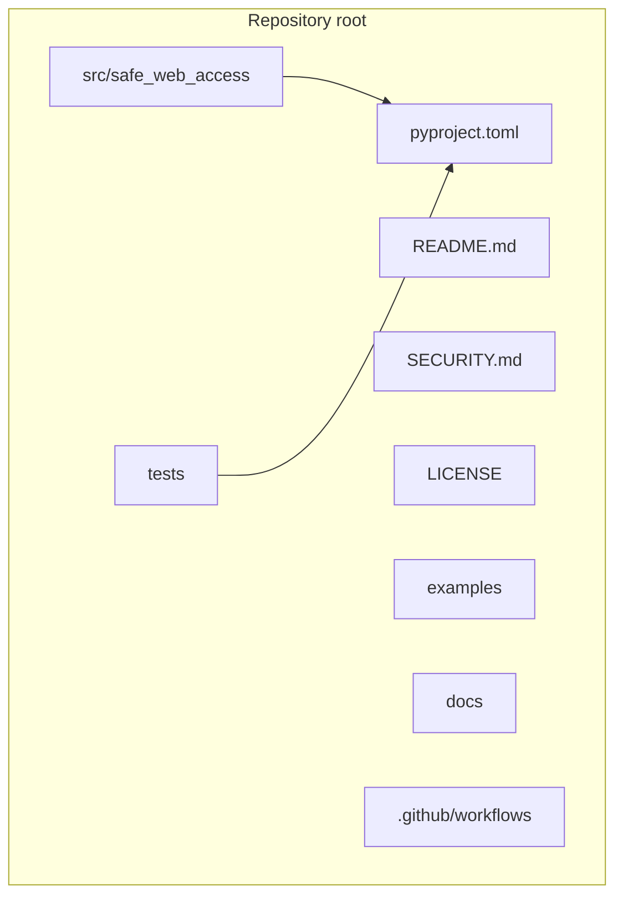
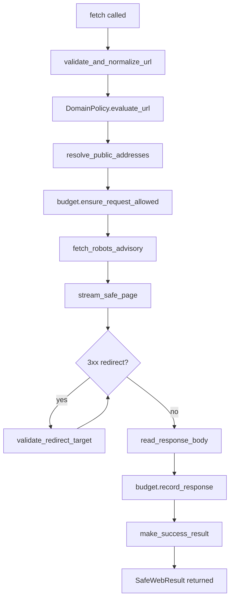

# Safe Web Access — Documentation Home

Welcome to the documentation for `safe-web-access`. This file is your starting point. It tells you what every part of the package does, how the parts connect to each other, and where to read more.

---

## Start Here

If you are new to this package, read in this order:

1. **[README.md](../README.md)** — What the package is, how to install it, five-minute quick start, all settings explained.
2. **[USAGE.md](USAGE.md)** — Step-by-step manual with practical recipes for every feature.
3. **[SECURITY.md](SECURITY.md)** — How safety works, what threats are covered, known limitations.
4. **[HANDOVER.md](HANDOVER.md)** — For maintainers: internal architecture, how to add features, build and release.

---

## Simple Mental Model

Think of `safe-web-access` as a careful librarian who goes to fetch a book for you. Before leaving, the librarian:

1. Checks that the address you gave is a real, properly-written address.
2. Checks that the address is on your approved list — not an internal staff-only room.
3. Looks up the actual physical location of the address and confirms it is a public building.
4. Checks how many books and total weight you are still allowed to carry.
5. Reads the building's "visitor rules" sign (robots.txt) and notes what it says.
6. Goes to the building, following any forwarding signs (redirects) — but checking each forwarded address before following.
7. When the librarian arrives, checks that the book is the right kind (content type).
8. Weighs the book before carrying it (byte limits).
9. Returns the book to you with a complete report — or returns an honest failure report if anything went wrong.

At no point does the librarian read the book or summarize it for you. That is your job.

---

## Package Vocabulary

These terms appear throughout the documentation. Learn them here once.

| Term | Simple Explanation | Technical Explanation |
|---|---|---|
| **URL** | A web address, like `https://example.com/page`. | A Uniform Resource Locator. Must use `http` or `https` scheme. |
| **Scheme** | The part before `://` (e.g., `https`). | Identifies the protocol. Only `http` and `https` are allowed. |
| **Hostname** | The domain part of the URL (e.g., `example.com`). | Resolved to one or more IP addresses via DNS. |
| **Port** | A numbered door on a server (e.g., 443 for HTTPS). | TCP port number. Default is 80 for HTTP, 443 for HTTPS. |
| **SSRF** | Tricking the server into fetching a private address. | Server-Side Request Forgery — an attacker causes the server to make requests to internal infrastructure. |
| **DNS** | The phone book of the internet — converts names to numbers. | Domain Name System — resolves hostnames to IP addresses. |
| **IP address** | The actual numerical address of a server. | A 32-bit (IPv4) or 128-bit (IPv6) number identifying a network interface. |
| **Private IP** | An address that only works inside a private network. | RFC-1918 ranges: `10.0.0.0/8`, `172.16.0.0/12`, `192.168.0.0/16`; loopback `127.0.0.0/8`; etc. |
| **Redirect** | When a website says "the page you want is over here now." | HTTP 3xx responses with a `Location` header pointing to another URL. |
| **robots.txt** | A file websites publish to tell crawlers what they can visit. | A plain-text file at `/<hostname>/robots.txt` following the Robots Exclusion Protocol. |
| **Content-Type** | The label on the box describing what is inside. | HTTP `Content-Type` response header, e.g. `text/html; charset=utf-8`. |
| **Crawl budget** | A spending limit on how many pages and bytes you fetch. | An immutable counter object tracking `pages_used` and `bytes_used` against configured maxima. |
| **Streaming** | Reading data in small pieces instead of all at once. | HTTP response body is consumed in chunks via `aiter_bytes()`. |
| **Frozen dataclass** | An object whose fields cannot be changed after creation. | Python `@dataclass(frozen=True)` — all attribute writes raise `FrozenInstanceError`. |
| **Event hook** | A function you register to receive telemetry notifications. | A callable (sync or async) that receives `SafeWebEvent` objects during request execution. |

---

## Reading Order for Specific Goals

| Goal | Read |
|---|---|
| Fetch one page quickly | README.md → Quick Start |
| Understand every result field | README.md → SafeWebResult |
| Restrict which domains are allowed | README.md → DomainPolicy, USAGE.md → Domain Recipes |
| Set up retries | README.md → RetryPolicy, USAGE.md → Retry Recipes |
| Track byte/page usage across requests | README.md → CrawlBudget, USAGE.md → Budget Recipes |
| Log or monitor requests | README.md → Event Hooks, USAGE.md → Event Hook Recipes |
| Use in a sync script | README.md → Sync Client |
| Use in an async framework | README.md → Async Client |
| Understand security model | SECURITY.md |
| Contribute or maintain | HANDOVER.md |

---

## Module-by-Module Reference

Every source file under `src/safe_web_access/` has exactly one responsibility. This section explains each file, what it owns, who calls it, and what must never be placed inside it.

### `__init__.py`

**What it owns:** Public API surface — the list of names importable from `safe_web_access`.

**Important exports:**
- `SafeWebClient`, `SyncSafeWebClient`
- `SafeWebSettings`, `SafeWebResult`, `CrawlBudget`
- `DomainPolicy`, `RetryPolicy`
- `SafeWebEvent`, `SafeWebEventType`, `EventHook`
- `__version__`

**Called by:** User code (`from safe_web_access import ...`).

**Must not contain:** Business logic, validation code, HTTP calls, or any implementation.

---

### `settings.py`

**What it owns:** `SafeWebSettings` — a single frozen dataclass holding every configurable limit for one client.

**Important items:**
- `connect_timeout_seconds`, `read_timeout_seconds`
- `max_redirects`, `max_response_bytes`
- `max_pages`, `max_total_bytes`
- `user_agent`, `allowed_content_types`
- `domain_policy`, `retry_policy`
- `strict_event_hooks`

**Called by:** `client.py`, `sync_client.py`, `transport.py`, `response_reader.py`, `robots_fetcher.py`.

**Must not contain:** Network calls, mutable state, or logic beyond field validation.

---

### `results.py`

**What it owns:** `SafeWebResult` — the single frozen, slotted dataclass returned by every `fetch()` call.

**Important items:**
- All result fields including `success`, `body`, `budget`, `error_code`.
- Strict `__post_init__` validation enforcing invariants (e.g., `body is not None` when `success=True`).

**Called by:** `result_builders.py`.

**Must not contain:** HTTP logic, network calls, or mutation of any kind.

---

### `client.py`

**What it owns:** `SafeWebClient` — the async orchestrator. Coordinates all validation, retry, robots, transport, and result-building steps.

**Important items:**
- `fetch(url, *, budget, check_robots)` — the main public method.
- `start()` — returns the client; optional, for callers managing the lifecycle by hand.
- `close()` — awaitable alias of `aclose()`.
- `aclose()` — idempotent async close.
- `_emit_event()` — internal hook dispatcher.
- Retry loop with backoff and delay.

**Called by:** `sync_client.py` (via background thread).

**Must not contain:** Parsing HTML, extracting business data, direct socket manipulation.

---

### `sync_client.py`

**What it owns:** `SyncSafeWebClient` — a synchronous wrapper around `SafeWebClient`.

**Important items:**
- `fetch(url, *, budget, check_robots)` — blocks until result is ready.
- `start()` — returns the client; optional, mirrors the async client.
- `close()` — idempotent synchronous close. Shuts down background thread and event loop.
- Uses `asyncio.new_event_loop()` and a daemon `threading.Thread`.

**Called by:** User code in synchronous contexts.

**Must not contain:** Async/await syntax visible to callers, or any safety logic. All safety lives in `client.py`.

---

### `policies.py`

**What it owns:** `DomainPolicy` — domain allowlist, blocklist, subdomain matching, and port filtering.

**Important items:**
- `allowed_domains`, `blocked_domains`, `allowed_ports`, `allow_subdomains`
- `evaluate_url(validated_url)` — raises `DomainNotAllowedError`, `BlockedDomainError`, or `PortNotAllowedError`.
- `_normalize_domain_entry()` — strips, lowercases, and validates domain strings.

**Called by:** `client.py`, `transport.py`, `robots_fetcher.py`.

**Must not contain:** DNS resolution or IP address inspection.

---

### `networks.py`

**What it owns:** `resolve_public_addresses` — DNS resolution plus IP safety classification.

**Important items:**
- `resolve_public_addresses(hostname)` — returns `NetworkCheckResult` or raises `UnsafeNetworkError` / `DnsResolutionError`.
- `_is_public_address(address)` — returns `True` only for globally-routable, non-private addresses.
- `NetworkCheckResult` — frozen dataclass with `hostname` and `addresses`.

**Called by:** `client.py`, `transport.py`, `redirects.py`, `robots_fetcher.py`.

**Must not contain:** HTTP requests, domain policy, or port checks.

---

### `urls.py`

**What it owns:** `validate_and_normalize_url` — URL parsing, normalization, and structural validation.

**Important items:**
- `validate_and_normalize_url(url)` — returns `ValidatedUrl` or raises `InvalidUrlError` / `UnsupportedSchemeError`.
- `ValidatedUrl` — frozen dataclass with `original`, `normalized`, `scheme`, `hostname`, `port`, `path`, `query`.
- Strips default ports, lowercases hostnames, rejects credentials and fragments.

**Called by:** `client.py`, `redirects.py`, `robots_fetcher.py`, `robots.py`, `transport.py`.

**Must not contain:** Network resolution or domain policy.

---

### `redirects.py`

**What it owns:** `validate_redirect_target` — validates one step in a redirect chain.

**Important items:**
- `validate_redirect_target(source_url, location, visited_urls, current_redirect_count, max_redirects, domain_policy)` — returns `RedirectResult` or raises on any violation.
- `RedirectResult` — frozen dataclass with `source_url`, `target`, `network`, `redirect_count`.
- Detects loops, enforces limits, validates domain policy and network safety.

**Called by:** `transport.py`, `robots_fetcher.py`.

**Must not contain:** HTTP requests or response body handling.

---

### `transport.py`

**What it owns:** `stream_safe_page` — async context manager for the streaming HTTP GET request with manual redirect loop.

**Important items:**
- `stream_safe_page(client, validated_url_str, settings, timeout)` — async context manager yielding `TransportStream`.
- `TransportStream` — frozen dataclass with `response`, `final_url`, `redirect_count`.
- Maps `httpx` transport exceptions to typed `SafeWebError` subclasses.

**Called by:** `client.py`.

**Must not contain:** Response body reading, content-type checking, or budget tracking.

---

### `response_reader.py`

**What it owns:** `read_response_body` — reads, validates, and size-limits the response body bytes.

**Important items:**
- `read_response_body(response, settings, budget)` — validates headers, streams body chunks, enforces limits.
- `ReadResponseResult` — frozen dataclass with `content_type`, `body`, `size_bytes`.
- Validates `Content-Length` early; measures bytes during streaming.

**Called by:** `client.py`.

**Must not contain:** Domain policy, DNS, redirect logic, or HTML parsing.

---

### `content_types.py`

**What it owns:** `validate_content_type` — parses and validates the `Content-Type` header.

**Important items:**
- `validate_content_type(content_type_header, allowed_content_types)` — returns `ContentTypeResult`.
- `ContentTypeResult` — frozen dataclass with `original`, `normalized`, `charset`, `is_text`, `is_pdf`.
- Rejects empty types, duplicate charsets, and types not in the allowlist.

**Called by:** `response_reader.py`.

**Must not contain:** Body reading, budget tracking, or network logic.

---

### `robots.py`

**What it owns:** Robots.txt parsing and evaluation.

**Important items:**
- `evaluate_robots_rules(target_url, robots_text, user_agent)` — returns `RobotsCheckResult`.
- `build_robots_url(target_url)` — constructs the `/robots.txt` URL for any target.
- `create_robots_unreachable_result(target_url, user_agent)` — fallback when robots.txt cannot be fetched.
- `RobotsStatus` — `StrEnum` with values `ALLOWED`, `DISALLOWED`, `MISSING`, `UNREACHABLE`, `INVALID`.
- `RobotsCheckResult` — frozen dataclass.

**Called by:** `robots_fetcher.py`.

**Must not contain:** HTTP requests or client logic.

---

### `robots_fetcher.py`

**What it owns:** `fetch_robots_advisory` — fetches robots.txt with redirect support, byte limits, and domain policy.

**Important items:**
- `fetch_robots_advisory(client, target_url, settings, timeout)` — returns `RobotsCheckResult`.
- Follows up to `min(settings.max_redirects, 3)` redirects.
- Caps robots.txt download at `min(262144, settings.max_response_bytes)` bytes.
- Returns `UNREACHABLE` on any error — never raises.

**Called by:** `client.py`.

**Must not contain:** Main page body reading or crawl budget updates.

---

### `budgets.py`

**What it owns:** `CrawlBudget` — immutable page and byte tracking.

**Important items:**
- `CrawlBudget(max_pages, max_total_bytes, pages_used=0, bytes_used=0)`.
- `ensure_request_allowed()` — raises `PageBudgetExceededError` or `ByteBudgetExceededError`.
- `record_response(size_bytes)` — returns a **new** `CrawlBudget` with updated counters.
- Properties: `remaining_pages`, `remaining_bytes`, `is_exhausted`.

**Called by:** `client.py`, `response_reader.py`.

**Must not contain:** HTTP logic or domain/network checks.

---

### `retries.py`

**What it owns:** `RetryPolicy` — retry configuration and delay calculation.

**Important items:**
- `RetryPolicy(max_attempts, backoff_base_seconds, backoff_max_seconds, backoff_multiplier, retry_status_codes, respect_retry_after, jitter_seconds)`.
- `is_retryable_status(status_code)` — returns `True` if the code is in `retry_status_codes`.
- `is_retryable_exception(exc)` — returns `True` for timeout and connection exceptions.
- `calculate_delay(attempt, response_headers)` — computes backoff delay, honouring `Retry-After`.

**Called by:** `client.py`.

**Must not contain:** HTTP requests, sleep calls, or budget logic.

---

### `events.py`

**What it owns:** Telemetry types and event hook type alias.

**Important items:**
- `SafeWebEventType` — `StrEnum` with all event type values.
- `SafeWebEvent` — frozen, slotted dataclass with telemetry metadata.
- `EventHook` — type alias for sync or async callables accepting `SafeWebEvent`.

**Called by:** `client.py`, `sync_client.py`.

**Must not contain:** Network calls, logging, or metric storage.

---

### `errors.py`

**What it owns:** `SafeWebErrorCode` — `StrEnum` of all possible error code strings.

**Important items:**
- `INVALID_URL`, `UNSUPPORTED_SCHEME`, `BLOCKED_HOST`, `PRIVATE_NETWORK`, `DNS_RESOLUTION_FAILED`
- `ROBOTS_DENIED`, `CONNECTION_TIMEOUT`, `READ_TIMEOUT`
- `TOO_MANY_REDIRECTS`, `UNSAFE_REDIRECT`
- `UNSUPPORTED_CONTENT_TYPE`, `RESPONSE_TOO_LARGE`
- `PAGE_BUDGET_EXCEEDED`, `BYTE_BUDGET_EXCEEDED`
- `HTTP_ERROR`, `REQUEST_FAILED`
- `DOMAIN_NOT_ALLOWED`, `BLOCKED_DOMAIN`, `PORT_NOT_ALLOWED`, `INVALID_POLICY`

**Called by:** `exceptions.py`, `result_builders.py`, `client.py`.

**Must not contain:** Logic, network calls, or exception handling.

---

### `exceptions.py`

**What it owns:** The full typed exception hierarchy.

**Important items:**
- `SafeWebError` — base exception with `error_code`, `current_url`, `redirect_count`, `status_code`, `size_bytes`.
- Subclasses: `InvalidUrlError`, `UnsupportedSchemeError`, `DnsResolutionError`, `UnsafeNetworkError`, `RedirectLoopError`, `RedirectLimitError`, `UnsafeRedirectError`, `MissingRedirectLocationError`, `UnsupportedContentTypeError`, `ResponseTooLargeError`, `PageBudgetExceededError`, `ByteBudgetExceededError`, `DomainNotAllowedError`, `BlockedDomainError`, `PortNotAllowedError`, `InvalidPolicyError`.
- Transport exceptions: `SafeWebTransportError`, `SafeWebConnectTimeout`, `SafeWebReadTimeout`, `SafeWebRequestTimeout`, `SafeWebConnectionError`.

**Called by:** All modules that raise or catch package exceptions.

**Must not contain:** HTTP calls, result building, or logging.

---

### `result_builders.py`

**What it owns:** Factory helpers for creating `SafeWebResult` objects.

**Important items:**
- `make_success_result(...)` — constructs a `success=True` result.
- `make_failure_result(...)` — constructs a `success=False` result from explicit arguments.
- `make_failure_from_exception(exc, ...)` — constructs a failure result directly from a `SafeWebError`.

**Called by:** `client.py`.

**Must not contain:** HTTP logic, validation, or side effects.

---

### `py.typed`

**What it owns:** PEP 561 marker file. Its presence signals to type checkers that this package ships inline type information.

**Called by:** Tools like mypy and Pyright when checking downstream code.

**Must not contain:** Any content. It is an empty marker file.

---

## Architecture Diagrams

### Repository Structure

### Internal Request Flow

### Public API Boundary

```mermaid
flowchart LR
    subgraph PUBLIC["Public - importable from safe_web_access"]
        SWC[SafeWebClient]
        SSC[SyncSafeWebClient]
        SWS[SafeWebSettings]
        SWR[SafeWebResult]
        CB[CrawlBudget]
        DP[DomainPolicy]
        RP[RetryPolicy]
        SE[SafeWebEvent]
        SET[SafeWebEventType]
        EH[EventHook]
        VER[__version__]
    end
    subgraph INTERNAL["Internal - not part of public API"]
        urls[urls.py]
        nets[networks.py]
        redir[redirects.py]
        trans[transport.py]
        rread[response_reader.py]
        rb[result_builders.py]
        rob[robots.py]
        robf[robots_fetcher.py]
        ct[content_types.py]
        err[errors.py]
        exc[exceptions.py]
    end
    PUBLIC --> INTERNAL
```

---

## Troubleshooting Map

| Symptom | Likely Cause | Where to Look |
|---|---|---|
| `ModuleNotFoundError: No module named 'safe_web_access'` | Package not installed | README.md → Installation |
| `DeprecationWarning: coroutine ... was never awaited` | Called async method without `await` | USAGE.md → Your First Async Request |
| `RuntimeError: Client is already closed` | Reusing a closed client | USAGE.md → Creating and Closing Clients |
| `result.error_code == "domain_not_allowed"` | Domain not in allowlist | README.md → DomainPolicy |
| `result.error_code == "port_not_allowed"` | Port not in `allowed_ports` | README.md → DomainPolicy |
| `result.error_code == "private_network"` | URL resolves to a private IP | SECURITY.md → DNS Resolution |
| `result.error_code == "unsupported_content_type"` | Server returned unexpected type | README.md → SafeWebSettings.allowed_content_types |
| `result.error_code == "response_too_large"` | Response exceeds `max_response_bytes` | README.md → SafeWebSettings.max_response_bytes |
| `result.error_code == "page_budget_exceeded"` | Budget `pages_used >= max_pages` | README.md → CrawlBudget |
| Retries not working | `max_attempts=1` (the default) | README.md → RetryPolicy |
| robots_status="disallowed" and page was still fetched | Advisory only — caller must enforce | README.md → Robots.txt Advisory |

---

## Glossary

| Term | Definition |
|---|---|
| `SafeWebClient` | Main async HTTP client class. |
| `SyncSafeWebClient` | Synchronous wrapper around `SafeWebClient`. |
| `SafeWebSettings` | Frozen dataclass holding all configurable limits. |
| `SafeWebResult` | Frozen dataclass returned by every `fetch()` call. |
| `CrawlBudget` | Immutable page and byte usage tracker. |
| `DomainPolicy` | Frozen dataclass for domain/port filtering. |
| `RetryPolicy` | Frozen dataclass for retry and backoff configuration. |
| `SafeWebEvent` | Frozen dataclass carrying telemetry metadata. |
| `SafeWebEventType` | StrEnum of all event type values. |
| `EventHook` | Type alias for a sync or async function accepting `SafeWebEvent`. |
| `SafeWebError` | Base class for all package exceptions. |
| `SafeWebErrorCode` | StrEnum of all error code strings. |
| `ValidatedUrl` | Frozen dataclass for a parsed and normalized URL. |
| `NetworkCheckResult` | Frozen dataclass for resolved public IP addresses. |
| `RedirectResult` | Frozen dataclass for one validated redirect hop. |
| `RobotsCheckResult` | Frozen dataclass for the robots.txt advisory result. |
| `RobotsStatus` | StrEnum: `ALLOWED`, `DISALLOWED`, `MISSING`, `UNREACHABLE`, `INVALID`. |
| `ReadResponseResult` | Frozen dataclass for validated response body bytes. |
| `ContentTypeResult` | Frozen dataclass for a validated content-type header. |
| `TransportStream` | Frozen dataclass yielded by `stream_safe_page`. |
| SSRF | Server-Side Request Forgery — an attacker causes the server to fetch a private address. |
| TOCTOU | Time-of-check / time-of-use — a race condition between IP resolution and connection. |
