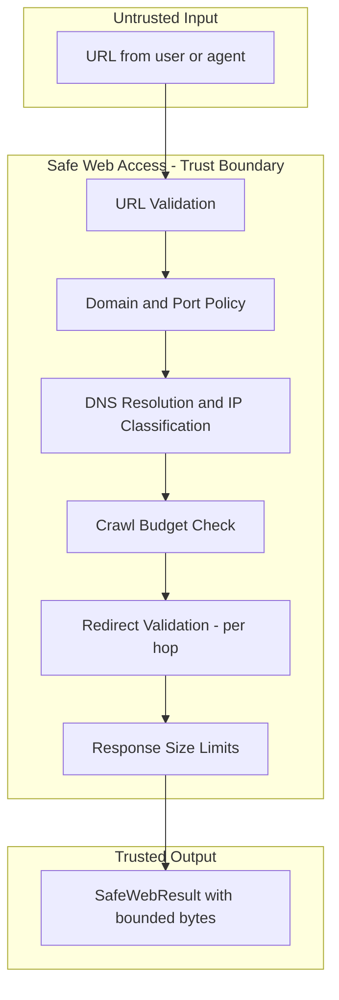
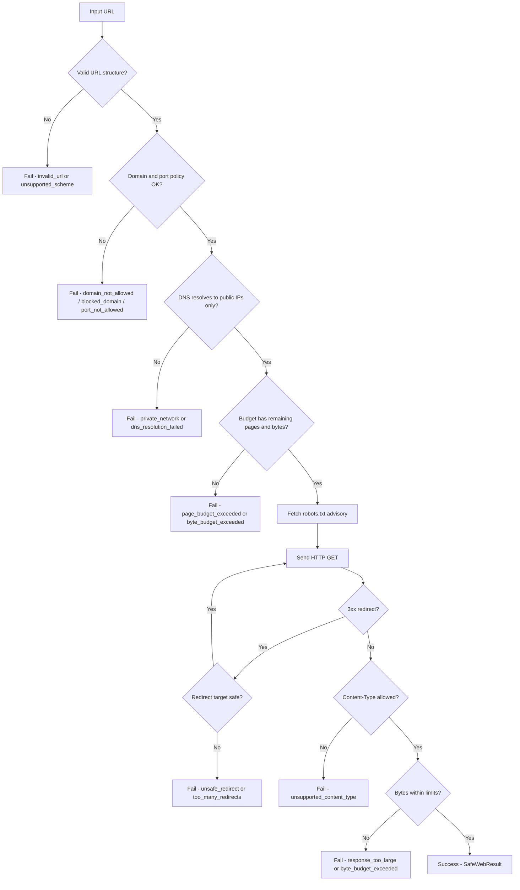

# Safe Web Access — Security Guide

This document describes the security model, threat scenarios, protections, known limitations, and recommended deployment patterns for `safe-web-access`.

---

## Security Goals

`safe-web-access` is designed to make the following guarantees when used correctly:

1. **Outbound HTTP requests do not reach private infrastructure.** Any URL that resolves to a private, loopback, link-local, multicast, or reserved IP address is blocked before any connection is attempted.
2. **Domain and port scope is enforced.** Requests are limited to the set of domains and ports you explicitly allow.
3. **Redirects do not bypass safety checks.** Every redirect destination is validated through the same safety pipeline as the original URL.
4. **Response downloads are bounded.** No single response exceeds `max_response_bytes`. No crawl session exceeds `max_total_bytes`. Downloads are streamed and measured — not buffered blindly.
5. **Retries are bounded and cannot amplify security failures.** Security violations are never retried.
6. **Telemetry events never leak sensitive data.** Event hooks receive no body bytes, no headers, no credentials.

---

## Non-Goals

The following are explicitly outside the security scope of this package:

- **No DNS rebinding protection at the socket level.** IP validation happens before connection — not during or after. A DNS server that changes its answer between resolution and TCP handshake can bypass this check.
- **No protection against malicious server-side content.** The package delivers raw bytes. Parsing those bytes safely is the caller's responsibility.
- **No JavaScript execution or browser isolation.**
- **No rate limiting.** The caller is responsible for controlling request frequency.
- **No authentication or credential management.**
- **No robots.txt enforcement.** robots.txt is advisory. The caller enforces it if desired.

---

## Assets Being Protected

| Asset | Protection Method |
|---|---|
| Internal network services (databases, admin panels, metadata endpoints) | SSRF IP classification and DNS resolution checks |
| Infrastructure exposed on non-standard ports | Port allowlist in `DomainPolicy.allowed_ports` |
| Memory and CPU | Response size limits, budget limits, redirect limits |
| Domain-restricted environments | Domain allowlist and blocklist in `DomainPolicy` |
| Sensitive data in telemetry | `SafeWebEvent` design explicitly excludes body, headers, credentials |

---

## Trust Boundaries



Every step inside the package boundary is a checkpoint. Failure at any checkpoint produces a structured failure result without making a network connection.

---

## Threat Actors

| Threat Actor | Example Attack | Defense |
|---|---|---|
| External user supplying URL | SSRF — submits `http://169.254.169.254/` | IP classification in `networks.py` |
| External user supplying URL | Port scan — submits `http://internal-db:5432/` | Port allowlist in `DomainPolicy` |
| Malicious website redirecting to internal host | Open redirect to `http://10.0.0.1/` | Per-hop redirect IP validation in `redirects.py` |
| Malicious website with huge response | Memory exhaustion / zip bomb | `max_response_bytes` and streaming limits |
| Malicious website with many redirects | Redirect loop denial of service | `max_redirects` limit and loop detection |
| Compromised DNS server | DNS rebinding attack | Partially mitigated (see DNS Rebinding section) |

---

## SSRF Explained — Simple Analogy

Imagine you are a concierge at a hotel. A guest asks you to deliver a package to an address they wrote on a card.

Most of the time, the address is a normal business — safe to visit. But one day, a guest writes an address that turns out to be your hotel's locked server room. If you deliver the package without checking, the guest has just gained access to a private, restricted area.

That is Server-Side Request Forgery (SSRF). A user or automated system gives your server a URL. Your server fetches it. If the URL points to an internal service — your database, your cloud metadata API, your admin panel — the attacker receives the response.

`safe-web-access` acts as a careful supervisor. Before delivering anything, it looks up the actual physical location of the address and verifies it is a real public place — not a staff-only room. If the address is suspicious, the delivery is refused.

Technically: before any TCP connection is opened, the package resolves the hostname to IP addresses and runs each address through Python's `ipaddress` module. Only addresses that are globally routable and do not belong to any private, loopback, link-local, multicast, or reserved range are allowed.

---

## URL Validation

All validation rules are applied by `urls.py` before any network activity.

| Check | What is rejected | Error code |
|---|---|---|
| Type check | Non-string input | `invalid_url` |
| Empty check | Empty or whitespace-only strings | `invalid_url` |
| Scheme check | Any scheme other than `http` or `https` | `unsupported_scheme` |
| Hostname check | URLs with no hostname component | `invalid_url` |
| Credential check | URLs with `user:pass@` embedded | `invalid_url` |
| Fragment check | URLs with `#anchor` fragments | `invalid_url` |
| Port range check | Port outside 1–65535 | `invalid_url` |

Normalization is applied to passing URLs:
- Hostname is lowercased
- Default ports (80 for http, 443 for https) are stripped
- Path defaults to `/` when absent
- IPv6 addresses are wrapped in square brackets

---

## Domain and Port Policies

`DomainPolicy` is evaluated after URL validation and before DNS resolution.

### Domain matching

Matching is case-insensitive. Trailing dots are stripped. Patterns are normalized at construction time.

**Exact match:** `"example.com"` matches only `example.com` (and its subdomains when `allow_subdomains=True`).

**Wildcard match:** `"*.example.com"` matches `api.example.com` and `blog.example.com` but NOT `example.com` itself.

**Blocklist priority:** Blocked patterns are evaluated first. A domain that matches a blocked pattern is rejected regardless of whether it also matches an allowed pattern.

### Bypass protections

The following patterns are rejected at `DomainPolicy` construction time:

- Entries containing `://` — would allow URL injection
- Entries containing `@` — would allow credential injection
- Entries containing `/`, `?`, `#`, spaces, or tabs — structural characters not valid in hostnames
- Entries containing `:` — port numbers are not allowed in domain entries
- Wildcard patterns that do not start with `*.` — e.g. `*example.com`
- Wildcard patterns with `*` in the base domain — e.g. `*.com`
- Wildcard patterns whose base domain contains no dot — e.g. `*.com` is too broad

These checks prevent attackers from constructing policy entries that accidentally match too broadly.

### Port policy

The effective port is derived from the URL port field, or from the scheme default (80 for `http`, 443 for `https`). If this port is not in `allowed_ports`, the request is rejected with `port_not_allowed` before DNS resolution.

Default `allowed_ports`: `(80, 443)`.

---

## DNS Resolution and IP Classification

DNS resolution and IP classification are the core SSRF defenses, implemented in `networks.py`.

### How DNS works

Think of DNS as a phone book. When you look up `example.com`, DNS gives you back a number — an IP address. Your computer then connects to that number.

Technically: `socket.getaddrinfo` is called with the hostname. It returns a list of `(family, type, proto, canonname, sockaddr)` tuples. The IP address is extracted from `sockaddr[0]`.

### IP classification

Each resolved IP address is checked using Python's `ipaddress` module:

| Classification | Example ranges | Blocked? |
|---|---|---|
| Private (RFC 1918) | `10.0.0.0/8`, `172.16.0.0/12`, `192.168.0.0/16` | ✅ Yes |
| Loopback | `127.0.0.0/8`, `::1` | ✅ Yes |
| Link-local | `169.254.0.0/16`, `fe80::/10` | ✅ Yes |
| Multicast | `224.0.0.0/4`, `ff00::/8` | ✅ Yes |
| Reserved | Various RFC-reserved ranges | ✅ Yes |
| Unspecified | `0.0.0.0`, `::` | ✅ Yes |
| Global (public) | Everything else with `is_global=True` | ✅ Allowed |

### Mixed safe/unsafe answers

If DNS returns multiple IP addresses and **any one** of them is private or unsafe, the entire request is blocked with `private_network`. A single unsafe IP in the list is enough to reject the host.

### Hardcoded localhost block

The hostname `localhost` and any hostname ending in `.localhost` are blocked unconditionally, before DNS resolution, because resolving them is unreliable across platforms.

---

## Redirect Security

Redirects are particularly dangerous for SSRF because a server can direct your application to an internal address through a redirect chain, bypassing initial domain and IP checks.

`safe-web-access` manually validates every redirect step.

### Redirect validation steps

For every `3xx` response received:

1. Read the `Location` header. If missing, raise `unsafe_redirect`.
2. Join the location to the source URL to resolve relative redirects.
3. Parse and normalize the resulting URL. If invalid, raise `unsafe_redirect`.
4. Evaluate domain and port policy. If not allowed, raise the appropriate policy error.
5. Check `max_redirects`. If the count would exceed the limit, raise `too_many_redirects`.
6. Normalize and compare with the set of already-visited URLs. If the target was already visited, raise `too_many_redirects` (loop detected).
7. Resolve the redirect target's hostname to IP addresses and check every IP for safety.
8. Only if all checks pass: update `current_url`, add source to visited set, send next `GET`.

### Loop detection

The set of visited URLs is tracked in normalized form. If the next redirect target matches any URL already visited in the current chain (including the original URL), the request is stopped with `too_many_redirects`.

### Robots.txt redirect handling

The robots.txt fetcher also follows redirects, but caps them at `min(settings.max_redirects, 3)` hops. On any error during robots.txt redirect handling, the result is `UNREACHABLE` — the main page fetch continues.

---

## Response Security

### Content-Type check

Before reading any response body bytes, the `Content-Type` response header is checked against `SafeWebSettings.allowed_content_types`. If the type is missing or not in the allowed list, the request fails with `unsupported_content_type`.

This check prevents downloading executable files, video streams, ZIP archives, or other dangerous binary formats that were not intended.

### Content-Length pre-check

If the response includes a `Content-Length` header, it is checked before streaming begins:
- Negative values → `response_too_large`
- Conflicting duplicate `Content-Length` values → `response_too_large`
- Value exceeding `max_response_bytes` → `response_too_large`
- Value exceeding `budget.remaining_bytes` → `byte_budget_exceeded`

### Streaming byte limit

Even when `Content-Length` is absent or passes the pre-check, the response body is measured chunk by chunk during streaming. If accumulated bytes exceed `max_response_bytes` or `budget.remaining_bytes`, the download is cancelled immediately.

This prevents:
- Servers that lie about `Content-Length`
- Servers that omit `Content-Length` but send very large bodies
- Decompression bombs — content that expands enormously when decompressed

**Note on decompression:** `httpx` handles `Content-Encoding: gzip` decompression automatically. The byte count in `safe-web-access` applies to the decompressed bytes as they arrive, which provides accurate measurement of actual memory consumption.

### Incomplete body behavior

If a streaming download is cancelled mid-way due to size limits, the request fails with `response_too_large` or `byte_budget_exceeded`. No partial body is returned.

---

## Retry Security

### Request amplification risk

Retries repeat HTTP requests to a server. Without bounds, unlimited retries could:
- Amplify load on the target server (retry storm)
- Consume budget bytes multiple times on temporary successes
- Allow an attacker to keep an expensive request alive indefinitely

### Bounded attempts

`RetryPolicy.max_attempts` sets a hard upper bound on the total number of attempts. There is no override mechanism.

### Non-retryable safety failures

The following failure categories are **never** retried, regardless of `retry_status_codes` or `max_attempts`:

- URL validation failures (`invalid_url`, `unsupported_scheme`)
- Domain or port policy violations (`domain_not_allowed`, `blocked_domain`, `port_not_allowed`)
- Network safety blocks (`private_network`, `dns_resolution_failed`)
- Response size limit exceeded (`response_too_large`, `byte_budget_exceeded`)
- Page budget exhausted (`page_budget_exceeded`)
- Content-type rejection (`unsupported_content_type`)

Only transport-level errors (`SafeWebConnectTimeout`, `SafeWebReadTimeout`, `SafeWebRequestTimeout`, `SafeWebConnectionError`) and HTTP status codes in `retry_status_codes` trigger retries.

### Retry-After header

When `respect_retry_after=True` and the server includes a `Retry-After` header, the package uses that value as the delay — but only up to `backoff_max_seconds`. The server cannot force the client to wait indefinitely.

`Retry-After` values in the past (negative computed delay) are ignored and exponential backoff is used instead.

### Retry storms

When many concurrent clients all retry at the same time, they create a surge of traffic at the moment the server recovers. Use `jitter_seconds > 0` to spread out retry timing.

### Budget semantics during retries

The crawl budget is not consumed on failed attempts. `record_response(size_bytes)` is called only after a successful `2xx` response is fully read. Retried attempts start fresh against the same budget.

---

## Robots.txt Ethics

`robots.txt` expresses a website's crawling preferences. Respecting it is good citizenship.

`safe-web-access` fetches and evaluates `robots.txt` before every page request (unless disabled). It reports the advisory result in `SafeWebResult.robots_status`.

**The package does not automatically block `DISALLOWED` pages.** This is an intentional design decision: some legitimate use cases (fetching public government data with explicit authorization, verifying your own site's robots rules, academic research with IRB approval) may legitimately access disallowed paths.

Your application receives the advisory result and decides the policy. If your use case requires respecting `DISALLOWED`, implement the check in your code:

```python
if result.robots_status == "disallowed":
    skip_this_page()
```

Do not treat robots.txt as a security boundary. It is a convention, not an enforcement mechanism. Malicious servers can publish permissive or misleading robots.txt files.

---

## Event Metadata Privacy

`SafeWebEvent` is designed to be safe to log without leaking sensitive data.

### What IS included in events

| Field | Example value |
|---|---|
| `event_type` | `"request_started"` |
| `requested_url` | `"https://example.com/page"` |
| `current_url` | `"https://example.com/page"` |
| `final_url` | `"https://example.com/page"` |
| `attempt_number` | `1` |
| `status_code` | `200` |
| `redirect_count` | `0` |
| `elapsed_ms` | `342` |
| `size_bytes` | `1256` |
| `error_code` | `None` |
| `message` | `"Robots status: allowed"` |

### What is NEVER included in events

| Data | Why excluded |
|---|---|
| Response body bytes | Could contain PII or proprietary content |
| Request headers | May contain `Authorization`, `Cookie`, or API keys |
| Response headers | May contain server secrets or session tokens |
| Authorization tokens | Direct credential leak risk |
| Cookies | Direct session leak risk |
| User passwords | Direct credential leak risk |

**Warning:** If you use a URL that contains query parameters with secrets (e.g. `?api_key=abc123`), those query parameters are part of `requested_url` and **will** appear in events. Store secrets in headers, not URL query parameters.

---

## Sync Client Security and Lifecycle

`SyncSafeWebClient` runs a background thread containing a private `asyncio` event loop. This architecture has specific security implications:

1. **Thread resource leak on abrupt process exit:** If the process crashes without calling `close()`, the background thread may not release its resources cleanly. Prefer the `with` context manager; if you manage the lifecycle by hand with `start()` / `close()`, put the `close()` in a `finally` block or an application shutdown hook so it runs on every path.

2. **Timeout during close:** `close()` waits up to 5 seconds for the background loop to finish its current request and shut down. If the request is still running after 5 seconds, the thread is abandoned (it is a daemon thread, so it will not prevent process exit).

3. **Not designed for concurrent requests:** Do not call `fetch()` concurrently from multiple threads on the same `SyncSafeWebClient` instance. Its internal state is not protected by a lock for concurrent use. Use one client per thread, or switch to `SafeWebClient` with async concurrency.

---

## Known DNS Rebinding / TOCTOU Limitation

This is the most significant known limitation of `safe-web-access`.

**What is DNS rebinding?**

Imagine a locksmith who checks your ID (IP address) before entering, but the door they are walking through has a sign that changes after they showed ID. By the time they are inside, the sign now says "Private Staff Only."

Technically: `safe-web-access` resolves the hostname to IP addresses, checks they are public and safe, then instructs `httpx` to open a TCP connection. There is a window of time between the IP check and the actual TCP connection. A malicious DNS server could:

1. Return a public IP during resolution (passes the IP check)
2. Change the DNS record to a private IP almost immediately
3. When `httpx` opens the connection, the operating system resolves the hostname again and gets the private IP

This is the TOCTOU (Time-of-Check, Time-of-Use) race condition in DNS resolution.

**How significant is this?**

Exploiting DNS rebinding requires:
- Control of a DNS server with very short TTL records
- Precise timing of the DNS record change
- A target server that responds to the internal address

This is a real but difficult attack. In most deployment environments, additional network-level controls (firewall rules, cloud security groups, VPC policies) provide additional layers of defense.

**Mitigations available to you:**

- Restrict outbound connections at the network/firewall level to known IP ranges
- Use cloud security groups that block outbound traffic to private subnets
- Implement DNS-over-HTTPS or a trusted internal DNS resolver with filtering

**What cannot be done without OS-level socket hooks:**

Full protection requires intercepting the socket connection at the moment of TCP handshake, reading the actual connected IP, and comparing it against the pre-checked IP. This would require a custom transport or OS-level network namespace. It is not implemented in this package.

---

## Security Decision Flow



---

## Unsafe Deployment Patterns

The following patterns reduce or eliminate the safety guarantees of this package.

### 1. Unauthenticated arbitrary-fetch endpoint

```python
# DANGEROUS: Anyone on the internet can make your server fetch any URL
@app.post("/fetch")
async def fetch_url(url: str) -> ...:
    result = await client.fetch(url)
    return result
```

Fix: Require authentication and rate limiting on any endpoint that accepts URLs from external users.

### 2. Unlimited response sizes

```python
# DANGEROUS: 100 MB per response is excessive for most use cases
settings = SafeWebSettings(max_response_bytes=100_000_000)
```

Fix: Set `max_response_bytes` to the smallest value that satisfies your legitimate use case.

### 3. Unlimited retries

```python
# DANGEROUS: 100 retries can hammer a server
policy = RetryPolicy(max_attempts=100)
```

Fix: Use 2–5 retries maximum. Add `jitter_seconds` to spread load.

### 4. Logging full URLs containing secrets

```python
# DANGEROUS: API key exposed in log
logger.info("Fetching %s", "https://api.service.com/data?api_key=SECRET")
```

Fix: Store secrets in headers, not URL query parameters. Log only the URL base, not query strings with secrets.

### 5. Disabling policy checks

```python
# DANGEROUS: No domain restriction — any public URL is reachable
policy = DomainPolicy(allowed_domains=None, blocked_domains=())
```

This is the default — acceptable for trusted use cases, but dangerous when URLs come from untrusted input. Always configure `allowed_domains` for production services that accept external URLs.

### 6. Trusting robots.txt as a security boundary

```python
# WRONG: robots.txt is not a security check
if result.robots_status == "allowed":
    sensitive_operation(result.body)
```

robots.txt is advisory etiquette, not access control. A malicious site can publish a permissive robots.txt while returning dangerous content. Apply your own access controls.

### 7. Parsing untrusted content without downstream protections

```python
# RISKY without further validation:
html = result.body.decode("utf-8", errors="replace")
soup = BeautifulSoup(html, "html.parser")  # Parsing is outside this package's scope
eval(soup.find("script").text)             # Never do this
```

`safe-web-access` delivers raw bytes safely. What you do with those bytes is your responsibility. Do not execute content you fetched from the internet.

---

## Recommended Deployment Checklist

- [ ] Set `DomainPolicy.allowed_domains` to a specific list for any service that accepts external URLs.
- [ ] Set `DomainPolicy.blocked_domains` for any internal domains that must be unreachable.
- [ ] Set `DomainPolicy.allowed_ports` to only the ports your use case needs.
- [ ] Set `SafeWebSettings.max_response_bytes` to a realistic maximum for your content type.
- [ ] Set `SafeWebSettings.max_total_bytes` based on your crawl session size.
- [ ] Configure `RetryPolicy.max_attempts` only as high as your use case justifies.
- [ ] Add authentication and rate limiting to any API endpoint that accepts URLs from users.
- [ ] Add network-level outbound traffic restrictions (firewall, security groups) independent of this package.
- [ ] Implement `robots_status == "disallowed"` handling in your code if you respect robots.txt.
- [ ] Use `strict_event_hooks=True` in tests to catch hook errors early.
- [ ] Never log response body content in production telemetry.
- [ ] Never embed secrets in URL query parameters.

---

## Security Testing Strategy

Tests use mocks and local transports and do not require real DNS or external internet access.

### Why no real DNS/network in tests?

1. **Reproducibility:** Real DNS can return different results across environments and over time.
2. **Isolation:** Tests must not depend on the availability of external services.
3. **Safety:** Tests that target private addresses could accidentally succeed in certain network environments, producing false positives.

### What the tests cover

- URL validation: malformed, empty, non-string, all rejected schemes, credentials, fragments.
- Domain policy: exact match, wildcard, blocklist, subdomain, port, suffix attacks.
- Network check: private IPv4 ranges, loopback, link-local, multicast, `localhost` keyword.
- Redirect: loop detection, limit enforcement, domain policy on targets, missing Location header.
- Response: Content-Type validation, Content-Length pre-check, streaming byte limits, budget exhaustion.
- Retries: max_attempts, backoff calculation, Retry-After delta seconds, Retry-After HTTP date, non-retryable errors.
- Events: no body content, no authorization header, hook isolation, strict mode.

---

## Vulnerability Reporting

To report a security vulnerability in `safe-web-access`:

1. **Do not open a public GitHub issue.** This exposes the vulnerability before a fix is available.
2. Open a **private security advisory** at: `https://github.com/mirza1272/safe-web-access/security/advisories/new`
3. Include in your report:
   - A description of the vulnerability and the affected component
   - Steps to reproduce (minimal code example if possible)
   - The impact you believe this vulnerability has
   - Any suggested mitigations you are aware of
4. You will receive an acknowledgement. A coordinated disclosure timeline will be agreed upon before any public announcement.
5. Please do not disclose the vulnerability publicly until a fix has been released.
