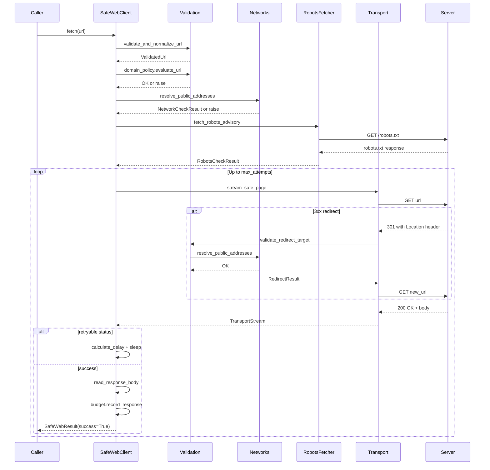

# Safe Web Access — User Manual

This manual walks you through every feature of `safe-web-access` with step-by-step explanations and practical recipes.

---

## Installation

```bash
python -m pip install safe-web-access
```

For development (includes test, lint, type check, and build tools):

```bash
python -m pip install -e ".[dev]"
```

---

## Verify Installation

After installing, confirm the package is available and check its version:

```bash
python -c "import safe_web_access; print(safe_web_access.__version__)"
```

You should see a version string like `0.1.2`.

---

## Your First Async Request

An **async** program is one that can do multiple things at the same time by pausing and resuming work. Python's `asyncio` library makes this possible. If you have never written async code before, that is fine — this example explains every line.

```python
"""Your first safe async web fetch."""

import asyncio                        # Python's built-in async library
from safe_web_access import SafeWebClient  # The async client


async def main() -> None:
    # 'async with' is like 'with', but for async resources.
    # It automatically closes the client when the block ends.
    async with SafeWebClient() as client:

        # 'await' means "pause here until this finishes".
        # fetch() always returns a SafeWebResult — it never raises an exception.
        result = await client.fetch("https://example.com")

        if result.success:
            # result.body is raw bytes — the exact bytes the server sent.
            # We decode them ourselves so we choose how to handle bad characters.
            text = result.body.decode("utf-8", errors="replace")

            print(f"Status:        {result.status_code}")   # e.g. 200
            print(f"Content-Type:  {result.content_type}")  # e.g. text/html
            print(f"Body size:     {result.size_bytes} bytes")
            print(f"Redirects:     {result.redirect_count}")
            print(f"Robots status: {result.robots_status}") # e.g. allowed
            print(f"Elapsed:       {result.elapsed_ms} ms")
        else:
            # result.error_code is a short machine-readable code.
            # result.error_message is a human-readable description.
            print(f"Fetch failed [{result.error_code}]: {result.error_message}")


# asyncio.run() starts the async program and runs it to completion.
asyncio.run(main())
```

---

## Your First Sync Request

If you do not want to deal with async code, use `SyncSafeWebClient`. It works exactly like a normal Python function call.

```python
"""Your first safe synchronous web fetch."""

from safe_web_access import SyncSafeWebClient  # The sync client


def main() -> None:
    # 'with' automatically closes the client when the block ends.
    with SyncSafeWebClient() as client:

        # fetch() blocks here until the result is ready.
        # It never raises an exception.
        result = client.fetch("https://example.com")

        if result.success:
            print(f"Status:    {result.status_code}")
            print(f"Body size: {result.size_bytes} bytes")
        else:
            print(f"Failed [{result.error_code}]: {result.error_message}")


if __name__ == "__main__":
    main()
```

---

## Creating and Closing Clients

### Async Client — Context Manager (recommended)

```python
async with SafeWebClient() as client:
    result = await client.fetch("https://example.com")
# Client is automatically closed here
```

### Async Client — Explicit Start and Close

Use this when the client outlives a single block: a service object created at application
startup, a FastAPI dependency, or a background worker.

```python
client = await SafeWebClient().start()
try:
    result = await client.fetch("https://example.com")
finally:
    await client.close()  # Always close, even if fetch raised something unexpected
```

`start()` returns the client, so the first line reads as one statement. It is **optional** —
a freshly constructed client is already usable, and `start()` exists so that manual lifecycle
code has a matching pair of calls instead of an asymmetric "construct, then close".

Calling `start()` twice is safe. Calling it after `close()` raises `RuntimeError`.

`close()` and `aclose()` do exactly the same thing; `aclose()` follows the async naming
convention, `close()` pairs visually with `start()`. Neither is deprecated.

### Sync Client — Context Manager (recommended)

```python
with SyncSafeWebClient() as client:
    result = client.fetch("https://example.com")
# Client is automatically closed here
```

### Sync Client — Explicit Start and Close

```python
client = SyncSafeWebClient().start()
try:
    result = client.fetch("https://example.com")
finally:
    client.close()
```

### Idempotent Close

Calling `close()` or `aclose()` more than once is safe — the second call does nothing.

```python
await client.close()
await client.aclose()  # Safe — same client, no error
```

### Behavior After Close

If you call `fetch()` on a closed client, you get a structured failure result — not an exception:

```python
await client.aclose()
result = await client.fetch("https://example.com")
# result.success == False
# result.error_code == "request_failed"
# result.error_message == "Client is closed."
```

---

## Fetch Method Reference

### Async signature

```python
async def fetch(
    url: str,
    *,
    budget: CrawlBudget | None = None,
    check_robots: bool = True,
) -> SafeWebResult:
```

### Sync signature

```python
def fetch(
    url: str,
    *,
    budget: CrawlBudget | None = None,
    check_robots: bool = True,
) -> SafeWebResult:
```

### Arguments

| Argument | Type | Default | Meaning |
|---|---|---|---|
| `url` | `str` | required | The URL to fetch. Can include or omit the `https://` prefix — the package adds it if missing. |
| `budget` | `CrawlBudget \| None` | `None` | An existing crawl budget to track page and byte usage. When `None`, a fresh budget is created from `SafeWebSettings.max_pages` and `SafeWebSettings.max_total_bytes`. |
| `check_robots` | `bool` | `True` | When `True`, fetches and evaluates robots.txt before fetching the target page. Pass `False` to skip this step. |

### Return value

Always returns a `SafeWebResult`. Never raises.

---

## Reading Result Bodies

`result.body` is always `bytes` when `result.success=True`. It is `None` on failure.

### Decoding text content

```python
if result.success and result.content_type.startswith("text/"):
    # Prefer using the charset from the Content-Type header if available.
    # Fall back to utf-8 with replacement characters for anything unexpected.
    text = result.body.decode("utf-8", errors="replace")
    print(text[:500])
```

### Handling PDF bytes

```python
if result.success and result.content_type == "application/pdf":
    # result.body contains the raw PDF bytes.
    # Pass to a PDF library (e.g. pdfplumber, pypdf) for text extraction.
    pdf_bytes = result.body
    with open("output.pdf", "wb") as f:
        f.write(pdf_bytes)
```

### Empty body

A 200 response with zero bytes is valid. Always check `result.size_bytes` before assuming there is content:

```python
if result.success:
    if result.size_bytes == 0:
        print("Server returned an empty body.")
    else:
        text = result.body.decode("utf-8", errors="replace")
```

**Parsing is outside this package's scope.** The package delivers raw bytes. HTML parsing, data extraction, text summarization, or any other processing is your responsibility.

---

## Custom Settings

All settings live in `SafeWebSettings`. Create one instance and pass it to the client.

```python
from safe_web_access import SafeWebClient, SafeWebSettings

settings = SafeWebSettings(
    connect_timeout_seconds=5.0,
    read_timeout_seconds=30.0,
    max_redirects=3,
    max_response_bytes=1_000_000,  # 1 MB per response
    user_agent="MyDocumentBot/2.0",
    allowed_content_types=("text/html", "text/plain"),
)

async with SafeWebClient(settings=settings) as client:
    result = await client.fetch("https://example.com")
```

---

## Domain Allowlist Recipes

### Only one domain

Allow requests only to `docs.example.com`. All other domains are rejected.

```python
from safe_web_access import DomainPolicy, SafeWebSettings, SafeWebClient

policy = DomainPolicy(allowed_domains=("docs.example.com",))
settings = SafeWebSettings(domain_policy=policy)

async with SafeWebClient(settings=settings) as client:
    good = await client.fetch("https://docs.example.com/guide")
    bad  = await client.fetch("https://other.com/page")
    # good.success is True (if the server responds correctly)
    # bad.success is False, bad.error_code == "domain_not_allowed"
```

### Parent domain plus all subdomains

Allow `example.com` and every subdomain of it.

```python
# allow_subdomains=True is the default — subdomains are included automatically
policy = DomainPolicy(
    allowed_domains=("example.com",),
    allow_subdomains=True,
)
# Matches: example.com, api.example.com, blog.example.com
# Does NOT match: other.com, notexample.com
```

Alternatively, use explicit wildcard patterns:

```python
policy = DomainPolicy(
    allowed_domains=("example.com", "*.example.com"),
    allow_subdomains=False,
)
# "example.com" matches exactly example.com
# "*.example.com" matches api.example.com, blog.example.com
```

### Block one subdomain

Allow `example.com` and its subdomains, but not `internal.example.com`.

```python
policy = DomainPolicy(
    allowed_domains=("example.com",),
    blocked_domains=("internal.example.com",),
    allow_subdomains=True,
)
# The blocklist takes priority over the allowlist.
# internal.example.com is blocked even though it is a subdomain of example.com.
```

### Custom port

Allow access to `example.com` on a non-standard port.

```python
policy = DomainPolicy(
    allowed_domains=("example.com",),
    allowed_ports=(80, 443, 8080, 8443),
)

async with SafeWebClient(settings=SafeWebSettings(domain_policy=policy)) as client:
    result = await client.fetch("https://example.com:8443/api")
```

### Deny everything by default (no allowlist)

When `allowed_domains=None` (the default), no domain allowlist is enforced — all public domains are reachable. Use a blocklist to explicitly deny specific domains.

```python
# Deny only example.com; allow everything else
policy = DomainPolicy(blocked_domains=("example.com",))
```

To deny everything except one domain, set `allowed_domains`:

```python
# Only example.com is allowed; everything else is denied
policy = DomainPolicy(allowed_domains=("example.com",))
```

### Common configuration mistakes

```python
# WRONG: Do not include the scheme in a domain entry
DomainPolicy(allowed_domains=("https://example.com",))  # Raises ValueError

# WRONG: Do not include a port in a domain entry
DomainPolicy(allowed_domains=("example.com:443",))  # Raises ValueError

# WRONG: Wildcard must start with "*."
DomainPolicy(allowed_domains=("example.*",))  # Raises ValueError

# WRONG: Wildcard base must contain a dot
DomainPolicy(allowed_domains=("*.com",))  # Raises ValueError — too broad

# CORRECT: Duplicate entries are not allowed
DomainPolicy(allowed_domains=("example.com", "example.com"))  # Raises ValueError
```

---

## Retry Recipes

### No retries (default)

```python
from safe_web_access import RetryPolicy

# Default: max_attempts=1 means one try, no retry
policy = RetryPolicy()
# or explicitly:
policy = RetryPolicy(max_attempts=1)
```

### Small retry policy

Retry up to 3 times with 0.5s → 1.0s → capped at 2.0s backoff:

```python
policy = RetryPolicy(
    max_attempts=3,
    backoff_base_seconds=0.5,
    backoff_multiplier=2.0,
    backoff_max_seconds=2.0,
)
```

### Handling 429 rate-limit responses

Respect the server's `Retry-After` header when rate-limited:

```python
policy = RetryPolicy(
    max_attempts=4,
    retry_status_codes=(429,),
    respect_retry_after=True,
    backoff_base_seconds=1.0,
    backoff_max_seconds=60.0,
)
```

When the server returns `Retry-After: 30`, the package waits 30 seconds (capped at `backoff_max_seconds=60.0`).

### Temporary server errors

Retry on server-side errors:

```python
policy = RetryPolicy(
    max_attempts=3,
    retry_status_codes=(502, 503, 504),
    backoff_base_seconds=1.0,
    backoff_multiplier=2.0,
    backoff_max_seconds=10.0,
)
```

### Deterministic tests (no sleeping)

Inject a no-op sleeper for fast unit tests. This eliminates actual `asyncio.sleep` delays:

```python
async def no_sleep(delay: float) -> None:
    pass  # Skip actual delay in tests

client = SafeWebClient(sleeper=no_sleep)
```

### Avoiding retry storms

Add jitter to spread out concurrent retries from many clients:

```python
policy = RetryPolicy(
    max_attempts=3,
    backoff_base_seconds=1.0,
    jitter_seconds=0.5,  # Adds 0.5s to every calculated delay
)
```

---

## Crawl-Budget Recipes

### Single request (no budget management needed)

When you pass no budget, a fresh one is created from `SafeWebSettings.max_pages` and `SafeWebSettings.max_total_bytes`. You do not need to track it.

```python
result = await client.fetch("https://example.com")
# A budget of max_pages=20, max_total_bytes=20_000_000 was used internally.
```

### Multiple requests with chained budget

Pass each result's budget to the next request:

```python
budget = CrawlBudget(max_pages=5, max_total_bytes=1_000_000)

result1 = await client.fetch("https://example.com/page1", budget=budget)
if result1.success:
    result2 = await client.fetch("https://example.com/page2", budget=result1.budget)
    if result2.success:
        result3 = await client.fetch("https://example.com/page3", budget=result2.budget)
```

### Page budget exhausted

```python
budget = CrawlBudget(max_pages=2, max_total_bytes=10_000_000)

result1 = await client.fetch("https://example.com/page1", budget=budget)
result2 = await client.fetch("https://example.com/page2", budget=result1.budget)
result3 = await client.fetch("https://example.com/page3", budget=result2.budget)

# result3.success == False
# result3.error_code == "page_budget_exceeded"
```

### Byte budget exhausted

```python
# Only allow 100 bytes total
budget = CrawlBudget(max_pages=10, max_total_bytes=100)

result = await client.fetch("https://example.com")
# result.success == False
# result.error_code == "byte_budget_exceeded"
```

### Passing the returned budget onward

The key rule: always use `result.budget`, not the original budget object.

```python
# CORRECT — chain through result.budget
r1 = await client.fetch(url1, budget=starting_budget)
r2 = await client.fetch(url2, budget=r1.budget)

# WRONG — reusing the original budget means counters never advance
r1 = await client.fetch(url1, budget=starting_budget)
r2 = await client.fetch(url2, budget=starting_budget)  # Bug: ignores pages_used from r1
```

---

## Robots Recipes

### Robots check enabled (default)

```python
result = await client.fetch("https://example.com/page", check_robots=True)
print(result.robots_status)  # "allowed", "disallowed", "missing", etc.
```

### Robots check disabled

Use this when you have established permission through other means:

```python
result = await client.fetch("https://example.com/page", check_robots=False)
# result.robots_status is None
```

### Reading robots status

```python
result = await client.fetch("https://example.com/page")

match result.robots_status:
    case "allowed":
        print("Explicitly allowed by robots.txt")
    case "disallowed":
        print("Disallowed by robots.txt — your policy decides what to do")
    case "missing":
        print("No robots.txt file found — typically treat as allowed")
    case "unreachable":
        print("Could not fetch robots.txt — network error or redirect issue")
    case "invalid":
        print("robots.txt was found but could not be parsed")
    case None:
        print("Robots check was skipped")
```

### Caller-enforced hard block

The package does not automatically block `disallowed` pages — that is your policy decision. To enforce it:

```python
result = await client.fetch("https://example.com/private")

# YOUR POLICY: treat disallowed as a hard block
if result.robots_status == "disallowed":
    print("Skipping page — robots.txt does not allow it.")
    # Do not process result.body
elif result.success:
    process(result.body)
else:
    log_failure(result)
```

This is intentional. Some use cases (such as fetching public government data) may have legitimate reasons to access disallowed paths with explicit permission.

---

## Event-Hook Recipes

### Print every event

```python
from safe_web_access import SafeWebClient, SafeWebEvent


def print_event(event: SafeWebEvent) -> None:
    print(f"[{event.event_type}] {event.requested_url}")


async with SafeWebClient(event_hooks=(print_event,)) as client:
    result = await client.fetch("https://example.com")
```

### Standard logging

```python
import logging
from safe_web_access import SafeWebClient, SafeWebEvent

logger = logging.getLogger("crawler")


def log_event(event: SafeWebEvent) -> None:
    # Safe: never logs body content, headers, or credentials
    logger.debug(
        "event=%s url=%s attempt=%d elapsed_ms=%d",
        event.event_type,
        event.requested_url,
        event.attempt_number,
        event.elapsed_ms,
    )


async with SafeWebClient(event_hooks=(log_event,)) as client:
    result = await client.fetch("https://example.com")
```

### Metrics counter

```python
from collections import Counter
from safe_web_access import SafeWebClient, SafeWebEvent, SafeWebEventType

event_counts: Counter[str] = Counter()


def count_events(event: SafeWebEvent) -> None:
    event_counts[event.event_type] += 1


async with SafeWebClient(event_hooks=(count_events,)) as client:
    await client.fetch("https://example.com")

print(dict(event_counts))
```

### Async hook

Both sync and async hook functions are supported:

```python
import asyncio
from safe_web_access import SafeWebClient, SafeWebEvent, SafeWebEventType


async def async_hook(event: SafeWebEvent) -> None:
    if event.event_type == SafeWebEventType.RETRY_SCHEDULED:
        # Could await an async alert system here
        await asyncio.sleep(0)  # Example — replace with real async call
        print(f"Retry scheduled: {event.message}")


async with SafeWebClient(event_hooks=(async_hook,)) as client:
    result = await client.fetch("https://example.com")
```

### Multiple hooks

```python
async with SafeWebClient(event_hooks=(log_event, count_events, async_hook)) as client:
    result = await client.fetch("https://example.com")
```

Hooks are called sequentially in the order they are registered.

### Isolated hook failure

By default, a crashing hook does not affect the request. The exception is silently ignored:

```python
def broken_hook(event: SafeWebEvent) -> None:
    raise RuntimeError("Oops")


async with SafeWebClient(event_hooks=(broken_hook,)) as client:
    result = await client.fetch("https://example.com")
    # result is still a valid SafeWebResult — broken_hook did not interfere
```

### Strict hook mode (for testing)

In tests, you may want hook failures to be visible. Set `strict_event_hooks=True`:

```python
settings = SafeWebSettings(strict_event_hooks=True)
async with SafeWebClient(settings=settings, event_hooks=(broken_hook,)) as client:
    result = await client.fetch("https://example.com")
    # Now result.error_code == "request_failed" because the hook raised
```

### Privacy-safe logging

Never log `result.body`, request headers, or authorization values. The `SafeWebEvent` object is designed to be safe to log entirely — it never contains body bytes, cookies, or credentials.

```python
def safe_log(event: SafeWebEvent) -> None:
    # All SafeWebEvent fields are safe to log
    logger.info(
        "type=%s url=%s status=%s error=%s",
        event.event_type,
        event.requested_url,
        event.status_code,
        event.error_code,
    )
```

---

## External httpx Client

You can inject an existing `httpx.AsyncClient` when you need to share a connection pool, set custom TLS settings, or use a mock transport for testing:

```python
import httpx
from safe_web_access import SafeWebClient, SafeWebSettings

# You own this client — you are responsible for closing it
external_client = httpx.AsyncClient(verify=True)

client = SafeWebClient(client=external_client)
try:
    result = await client.fetch("https://example.com")
finally:
    # You must close the external client — SafeWebClient does NOT close injected clients
    await external_client.aclose()
    await client.aclose()
```

**Resource ownership rule:** When you create the `httpx.AsyncClient` and pass it in, you own it. `SafeWebClient` will not close it when `aclose()` is called. When `SafeWebClient` creates its own client internally (the default), it owns and closes it.

---

## Common Failure Scenarios

### `invalid_url` — malformed URL

**Cause:** URL is empty, not a string, contains credentials (`user:pass@`), a fragment (`#section`), or an unsupported scheme.

**Result fields:**
- `success=False`
- `error_code="invalid_url"` (or `"unsupported_scheme"`)
- `error_message` describes the specific problem

**Developer action:** Validate URLs before passing them to `fetch()`. Strip fragments and credentials.

---

### `private_network` — SSRF block

**Cause:** The hostname resolved to a private, loopback, link-local, multicast, or reserved IP address.

**Result fields:**
- `success=False`
- `error_code="private_network"`
- `error_message="Hostname resolves to an unsafe network address."`

**Developer action:** If you believe this is a legitimate public host, check DNS resolution independently. This block cannot be disabled — it is a security control.

---

### `domain_not_allowed` — domain policy violation

**Cause:** The URL's domain is not in the `DomainPolicy.allowed_domains` list.

**Result fields:**
- `success=False`
- `error_code="domain_not_allowed"`

**Developer action:** Add the domain to `allowed_domains`, or set `allowed_domains=None` to allow all public domains.

---

### `unsupported_content_type` — wrong content type

**Cause:** The server responded with a `Content-Type` not in `SafeWebSettings.allowed_content_types`.

**Result fields:**
- `success=False`
- `error_code="unsupported_content_type"`
- `status_code` contains the HTTP status (often 200)

**Developer action:** Add the needed type to `allowed_content_types`. For example, add `"application/pdf"` for PDF support.

---

### `response_too_large` — download limit exceeded

**Cause:** The declared `Content-Length` or the accumulated streaming bytes exceeded `SafeWebSettings.max_response_bytes`.

**Result fields:**
- `success=False`
- `error_code="response_too_large"`

**Developer action:** Increase `max_response_bytes` in `SafeWebSettings`, or target a smaller resource.

---

### `page_budget_exceeded` — budget exhausted

**Cause:** `CrawlBudget.pages_used >= CrawlBudget.max_pages` before the request was made.

**Result fields:**
- `success=False`
- `error_code="page_budget_exceeded"`

**Developer action:** Create a larger budget, or stop fetching after the budget is exhausted. Check `result.budget.is_exhausted` between requests.

---

### `http_error` — non-2xx response

**Cause:** The server returned a status code outside 200–299 that was not configured for retry, or retries were exhausted.

**Result fields:**
- `success=False`
- `error_code="http_error"` (or `"read_timeout"` for 408, `"response_too_large"` for 413)
- `status_code` contains the actual HTTP status

**Developer action:** Check `result.status_code`. Configure retry for transient errors. Treat 404, 403, 401 as permanent failures.

---

## Testing Applications That Use Safe Web Access

Use `httpx.MockTransport` to test your code without making real network requests:

```python
import httpx
import pytest
from safe_web_access import SafeWebClient


def make_mock_client(status: int, content_type: str, body: bytes) -> SafeWebClient:
    """Build a SafeWebClient backed by a fake transport."""

    def handler(request: httpx.Request) -> httpx.Response:
        return httpx.Response(
            status_code=status,
            headers={"Content-Type": content_type},
            content=body,
        )

    transport = httpx.MockTransport(handler)
    http_client = httpx.AsyncClient(transport=transport)
    return SafeWebClient(client=http_client)


@pytest.mark.asyncio
async def test_successful_fetch() -> None:
    client = make_mock_client(
        status=200,
        content_type="text/html",
        body=b"<html><body>Hello</body></html>",
    )
    async with client:
        result = await client.fetch("https://example.com")

    assert result.success
    assert result.status_code == 200
    assert result.body == b"<html><body>Hello</body></html>"


@pytest.mark.asyncio
async def test_http_error_response() -> None:
    client = make_mock_client(status=404, content_type="text/html", body=b"")
    async with client:
        result = await client.fetch("https://example.com/missing")

    assert not result.success
    assert result.status_code == 404
    assert result.error_code == "http_error"
```

---

## FastAPI Integration Example

This is a minimal example showing how to use `safe-web-access` inside a FastAPI application. It is not a complete application.

```python
"""Minimal FastAPI integration example."""

from contextlib import asynccontextmanager
from typing import AsyncGenerator, Any

from fastapi import FastAPI, Depends, HTTPException
from pydantic import BaseModel

from safe_web_access import (
    CrawlBudget,
    DomainPolicy,
    SafeWebClient,
    SafeWebSettings,
)


# ---- Shared client managed via lifespan ----

_client: SafeWebClient | None = None


@asynccontextmanager
async def lifespan(app: FastAPI) -> AsyncGenerator[None, None]:
    global _client
    settings = SafeWebSettings(
        domain_policy=DomainPolicy(allowed_domains=("example.com",)),
        max_response_bytes=500_000,
    )
    _client = SafeWebClient(settings=settings)
    yield
    if _client is not None:
        await _client.aclose()


app = FastAPI(lifespan=lifespan)


def get_client() -> SafeWebClient:
    if _client is None:
        raise RuntimeError("Client not initialized")
    return _client


# ---- Request / response models ----

class FetchRequest(BaseModel):
    url: str


class FetchResponse(BaseModel):
    success: bool
    status_code: int | None
    content_type: str | None
    size_bytes: int
    error_code: str | None


# ---- Endpoint ----

@app.post("/fetch", response_model=FetchResponse)
async def fetch_url(
    body: FetchRequest,
    client: SafeWebClient = Depends(get_client),
) -> Any:
    # WARNING: This endpoint fetches any URL the caller supplies.
    # In production, add authentication and rate limiting before this.
    budget = CrawlBudget(max_pages=1, max_total_bytes=500_000)
    result = await client.fetch(body.url, budget=budget)
    return FetchResponse(
        success=result.success,
        status_code=result.status_code,
        content_type=result.content_type,
        size_bytes=result.size_bytes,
        error_code=result.error_code,
    )
```

---

## AI-Agent Integration Example

An AI agent may decide which URL to visit based on a search result or a plan. Even though the agent chose the URL, `safe-web-access` still validates it fully before fetching.

```python
"""Generic AI-agent fetch example."""

import asyncio
from safe_web_access import (
    CrawlBudget,
    DomainPolicy,
    SafeWebClient,
    SafeWebSettings,
)


async def agent_fetch(url: str) -> str | None:
    """
    An agent calls this function with a URL it chose.
    The URL is still validated and safety-checked before fetching.
    """
    settings = SafeWebSettings(
        domain_policy=DomainPolicy(allowed_ports=(80, 443)),
        max_response_bytes=500_000,
    )
    budget = CrawlBudget(max_pages=1, max_total_bytes=500_000)

    async with SafeWebClient(settings=settings) as client:
        result = await client.fetch(url, budget=budget)

    if result.success:
        return result.body.decode("utf-8", errors="replace")
    else:
        print(f"Agent fetch failed [{result.error_code}]: {result.error_message}")
        return None


asyncio.run(agent_fetch("https://example.com/article"))
```

---

## RAG / Ingestion Integration Example

This example shows how you might use `safe-web-access` to fetch a list of public documents for a Retrieval-Augmented Generation (RAG) pipeline or knowledge base. The URLs here are examples — replace them with your actual document sources.

```python
"""Generic public-document ingestion example."""

import asyncio
from safe_web_access import CrawlBudget, SafeWebClient, SafeWebSettings

# Replace these example URLs with your actual document sources
DOCUMENT_URLS = [
    "https://example.com/doc1.txt",
    "https://example.com/doc2.txt",
]


async def ingest_documents() -> list[bytes]:
    settings = SafeWebSettings(
        allowed_content_types=("text/plain", "text/html"),
        max_response_bytes=2_000_000,
    )
    budget = CrawlBudget(max_pages=len(DOCUMENT_URLS), max_total_bytes=10_000_000)
    documents: list[bytes] = []

    async with SafeWebClient(settings=settings) as client:
        for url in DOCUMENT_URLS:
            result = await client.fetch(url, budget=budget)
            if result.success:
                documents.append(result.body)
                budget = result.budget  # Chain the budget
            else:
                print(f"Skipping {url}: [{result.error_code}] {result.error_message}")

    return documents


asyncio.run(ingest_documents())
```

---

## Troubleshooting

### ModuleNotFoundError: No module named 'safe_web_access'

The package is not installed. Run:
```bash
python -m pip install safe-web-access
```

### RuntimeWarning: Enable tracemalloc to get the object allocation traceback

You are running async code without `await`. Make sure you use `await client.fetch(...)` not `client.fetch(...)`.

### RuntimeError: Client is already closed

You are calling `fetch()` after the client was closed. Create a new client or restructure your code so the client stays open while you need it.

### result.error_code == "domain_not_allowed"

Your `DomainPolicy.allowed_domains` does not include this domain. Check your `DomainPolicy` configuration. If you want to allow all public domains, set `allowed_domains=None` (the default).

### result.error_code == "port_not_allowed"

The URL uses a port not in `DomainPolicy.allowed_ports`. Add the port to the list.

### result.error_code == "private_network"

The hostname resolved to a private, loopback, or reserved IP. This is a security block. Verify that the URL is truly a public internet address and not pointing to internal infrastructure.

### result.error_code == "unsupported_content_type"

The server sent a content type not in `allowed_content_types`. Add the needed type to `SafeWebSettings.allowed_content_types`.

### result.error_code == "response_too_large"

Increase `SafeWebSettings.max_response_bytes`. Check that the target resource is reasonable in size.

### result.error_code == "page_budget_exceeded"

Your `CrawlBudget` ran out of pages. Create a larger budget, or stop fetching and check `result.budget.is_exhausted` between requests.

### Retries are not happening

Check that `RetryPolicy.max_attempts` is greater than 1. The default is `max_attempts=1` (no retry). Also verify that the failure is a retryable error code or status (security failures are never retried).

### robots_status="disallowed" but the page was still fetched

This is intentional. robots.txt checking is advisory. Your code must decide whether to use the result. See the Robots Recipes section above for how to enforce it.

---

## Complete API Quick Reference

### Classes

| Class | Module | Kind | Purpose |
|---|---|---|---|
| `SafeWebClient` | `client.py` | class | Async client — main entry point |
| `SyncSafeWebClient` | `sync_client.py` | class | Sync client wrapper |
| `SafeWebSettings` | `settings.py` | frozen dataclass | All configuration limits |
| `SafeWebResult` | `results.py` | frozen dataclass | Every fetch result |
| `CrawlBudget` | `budgets.py` | frozen dataclass | Immutable page/byte tracker |
| `DomainPolicy` | `policies.py` | frozen dataclass | Domain/port filtering |
| `RetryPolicy` | `retries.py` | frozen dataclass | Retry configuration |
| `SafeWebEvent` | `events.py` | frozen dataclass | Telemetry event |
| `SafeWebEventType` | `events.py` | StrEnum | Event type constants |
| `EventHook` | `events.py` | type alias | Sync or async hook callable |

### Methods

| Method | Class | Returns | Description |
|---|---|---|---|
| `fetch(url, *, budget, check_robots)` | `SafeWebClient` | `SafeWebResult` | Async fetch with all safety checks |
| `aclose()` | `SafeWebClient` | `None` | Idempotent async close |
| `fetch(url, *, budget, check_robots)` | `SyncSafeWebClient` | `SafeWebResult` | Sync fetch with all safety checks |
| `close()` | `SyncSafeWebClient` | `None` | Idempotent sync close |
| `record_response(size_bytes)` | `CrawlBudget` | `CrawlBudget` | Returns new budget with updated counters |
| `ensure_request_allowed()` | `CrawlBudget` | `None` | Raises if budget is exhausted |
| `evaluate_url(validated_url)` | `DomainPolicy` | `None` | Raises if URL violates policy |
| `is_retryable_status(status_code)` | `RetryPolicy` | `bool` | True if code triggers retry |
| `is_retryable_exception(exc)` | `RetryPolicy` | `bool` | True if exception triggers retry |
| `calculate_delay(attempt, headers)` | `RetryPolicy` | `float` | Backoff delay in seconds |

---

## Fetch Sequence Diagram


